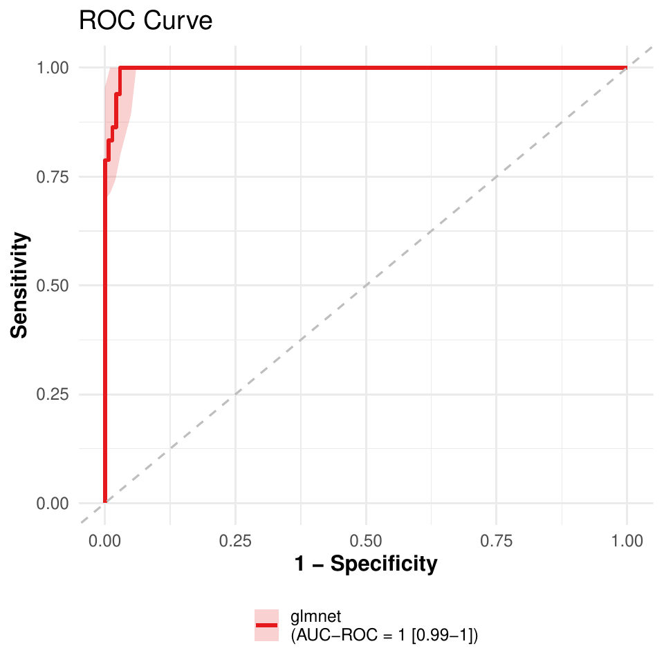
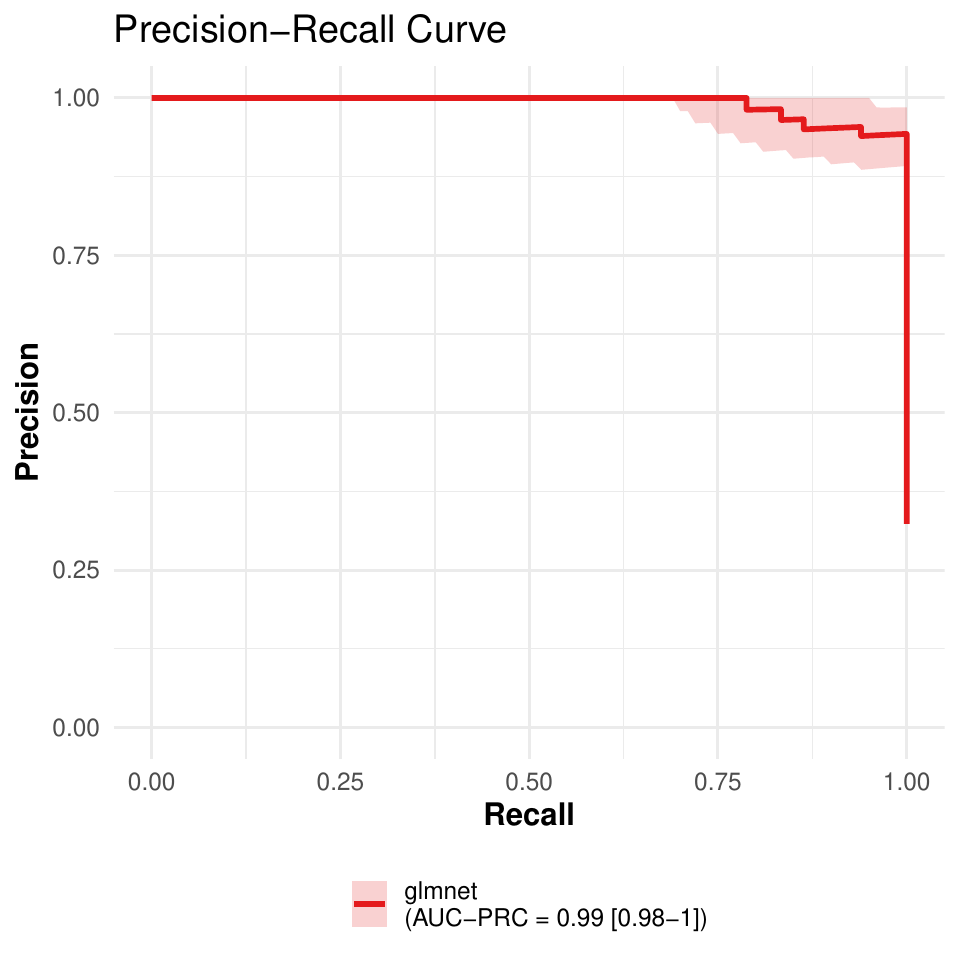

# Classification

``` r

library(pipeML)
library(dplyr)
#> 
#> Attaching package: 'dplyr'
#> The following objects are masked from 'package:stats':
#> 
#>     filter, lag
#> The following objects are masked from 'package:base':
#> 
#>     intersect, setdiff, setequal, union
```

## **Data**

`data_example_classification` is the Breast Cancer Wisconsin dataset: 9
cell features per sample and a `target` column (`1` = malignant, `0` =
benign).

``` r

data <- pipeML::data_example_classification
X <- data %>% dplyr::select(-target)
y <- data$target
```

Split the samples into a training and a test set:

``` r

set.seed(123)
train_idx <- caret::createDataPartition(y, p = 0.7, list = FALSE)

X_train <- X[train_idx, ]
X_test  <- X[-train_idx, ]
y_train <- y[train_idx]
y_test  <- y[-train_idx]
```

## **Train models**

[`compute_features.training.ML()`](https://verapancaldilab.github.io/pipeML/reference/compute_features.training.ML.md)
trains and tunes 11 classification algorithms (bagged trees, random
forest, C5.0, elastic net, lasso, ridge, k-nearest neighbours, CART,
linear and radial SVM, and XGBoost) with repeated stratified k-fold
cross-validation, and selects the best one.

Key parameters:

- **trait.positive**: value of `target_var` considered as the positive
  class
- **metric**: metric used to tune the hyperparameters of each model and
  to select the best model, `"AUROC"` (default) or `"AUPRC"`
- **k_folds**, **n_rep**: number of folds and repetitions of the
  cross-validation
- **ncores**: number of cores used to run the folds in parallel (`NULL`
  runs sequentially)
- **seed**: random seed for the folds and the model fitting (default
  `123`), so results are reproducible
- **preprocess**: whether to remove near-constant and highly correlated
  features (\|r\| \> 0.9) from the training features before the
  cross-validation (default `TRUE`). The outcome is not used for this.
  Here it removes `Cell.size`, which is highly correlated with
  `Cell.shape`, so the models are trained on 8 of the 9 features. Use
  `preprocess = FALSE` to train on the features as given
- **return**: whether to save the cross-validation performance plots in
  `Results/` (named with `file_name`)

``` r

res <- compute_features.training.ML(features_train = X_train,
                                    target_var = y_train,
                                    task_type = "classification",
                                    trait.positive = "1",
                                    metric = "AUROC",
                                    k_folds = 5,
                                    n_rep = 2,
                                    ncores = 2,
                                    seed = 123,
                                    file_name = "Example_classification",
                                    return = TRUE)
```

The selected model is a `caret` `train` object, trained on all training
samples with the hyperparameters selected by `metric` (in `bestTune`):

``` r

res$Model
res$Model$bestTune
```

All trained and tuned models (a model that predicts the same probability
for all training samples is left out):

``` r

names(res$ML_Models)
```

`res$AUROC_median` and `res$AUPRC_median` compare the cross-validation
performance of all the algorithms: the median (`Median_AUROC`,
`Median_AUPRC`) and the MAD (`MAD_AUROC`, `MAD_AUPRC`) across resamples,
sorted from the best to the worst model. The performance of the selected
model per resample is in `res$Model$resample`:

``` r

res$AUROC_median
res$AUPRC_median
head(res$Model$resample)
```

With `return = TRUE`, both tables are also saved as plots in `Results/`
(`AUROC_CV_methods_<file_name>.pdf` and
`AUPRC_CV_methods_<file_name>.pdf`). In each plot:

- the models are sorted from the best to the worst, with the median
  value above each bar;
- the selected model (the best one for `metric`) is in blue;
- the error bars show the median plus and minus one MAD across
  resamples;
- the dashed line is the performance of a random classifier: 0.5 for
  AUROC, and the proportion of positive samples for AUPRC.


Figure 1. Cross-validation AUROC of the trained models.


Figure 2. Cross-validation AUPRC of the trained models. The blue bar is
still the model selected by AUROC.

## **Predict on test data**

[`compute_prediction()`](https://verapancaldilab.github.io/pipeML/reference/compute_prediction.md)
applies the selected model to the test set. The test data must contain
the features used for training, and `target_var` must be in the order of
the rows of `test_data`, without missing values and with samples of both
classes (AUROC and AUPRC cannot be calculated otherwise):

``` r

pred <- compute_prediction(model = res$Model,
                           test_data = X_test,
                           target_var = y_test,
                           task_type = "classification",
                           trait.positive = "1",
                           file.name = "Example_classification",
                           return = TRUE)
```

AUROC and AUPRC on the test set. Each is a list with the `estimate` on
the full test set and the `lower` and `upper` bounds of its 95%
confidence interval, from 1000 bootstrap resamples of the test samples:

``` r

pred$AUC
```

Predicted probabilities of each class (`yes` is the positive class):

``` r

head(pred$Predictions)
```

Accuracy, sensitivity, specificity, precision, recall, F1 score and MCC
at each probability threshold (one row per test sample, sorted by
decreasing predicted probability):

``` r

head(pred$Metrics)
```

With `return = TRUE`, the ROC and precision-recall curves are saved in
`Results/` (named with `file.name`). The shaded areas are pointwise 95%
bootstrap confidence bands, also returned in `pred$Curve_bands`.



Figure 3. ROC curve on the test set.



Figure 4. Precision-recall curve on the test set.

The curves can also be drawn directly with
[`get_curves()`](https://verapancaldilab.github.io/pipeML/reference/get_curves.md):

``` r

get_curves(data = pred$Metrics,
           color = "model",
           auc_roc = pred$AUC$AUROC,
           auc_prc = pred$AUC$AUPRC,
           roc_band = pred$Curve_bands$ROC,
           prc_band = pred$Curve_bands$PRC,
           file.name = "Example_classification_curves")
```

## **SHAP values**

[`compute_shap_values()`](https://verapancaldilab.github.io/pipeML/reference/compute_shap_values.md)
explains which features drive the predictions of the selected model. It
only needs the trained model:

``` r

shap <- compute_shap_values(model_trained = res$Model,
                            task_type = "classification",
                            seed = 123)
head(shap)
```

See the **Interpreting models with SHAP values** tutorial for how to
read and plot them.

## **Training and prediction in one step**

When the test set is already prepared,
[`compute_features.ML()`](https://verapancaldilab.github.io/pipeML/reference/compute_features.ML.md)
trains the models on the training set and applies the selected one to
the test set. The outcome is read from `coldata`, whose row names must
be the sample names of the feature tables; `trait` is the outcome
column:

``` r

res_onestep <- compute_features.ML(features_train = X_train,
                                   features_test = X_test,
                                   coldata = data,
                                   task_type = "classification",
                                   trait = "target",
                                   trait.positive = "1",
                                   metric = "AUROC",
                                   k_folds = 5,
                                   n_rep = 2,
                                   ncores = 2,
                                   file_name = "Example_onestep",
                                   return = FALSE)
```

`res_onestep$Model` is the output of
[`compute_features.training.ML()`](https://verapancaldilab.github.io/pipeML/reference/compute_features.training.ML.md),
and the test set results are in `AUC`, `Metrics`, `Prediction` and
`Curve_bands`:

``` r

res_onestep$Model$Model
res_onestep$AUC
```
