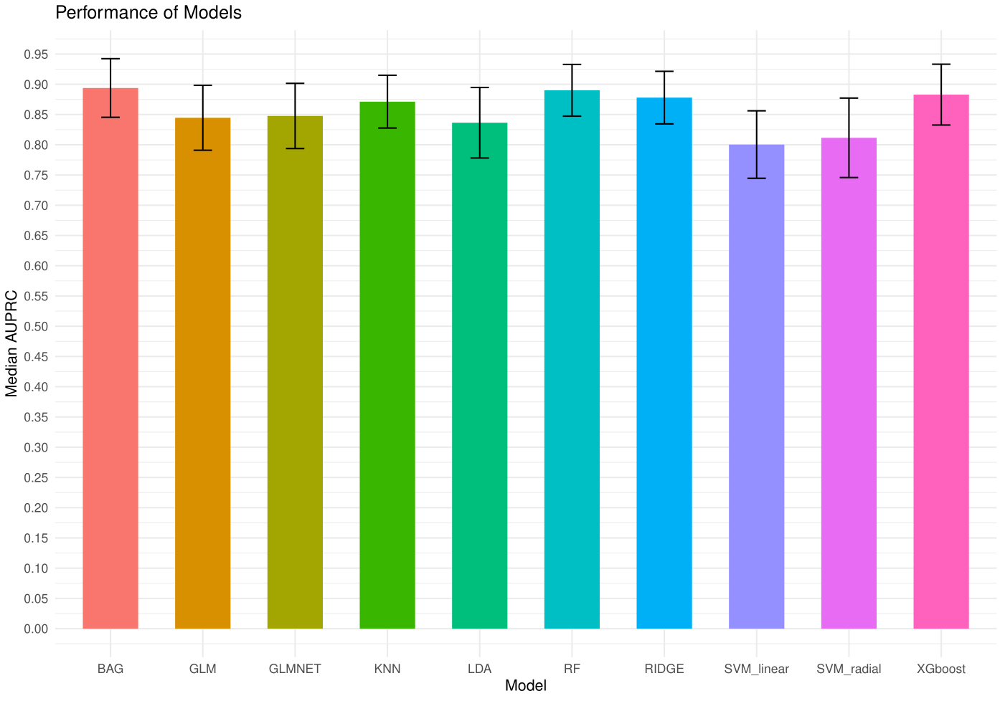
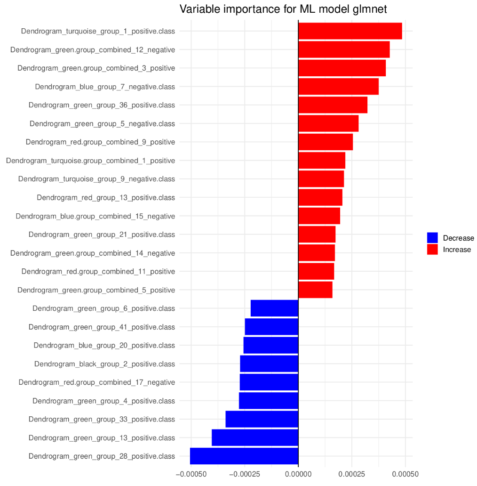
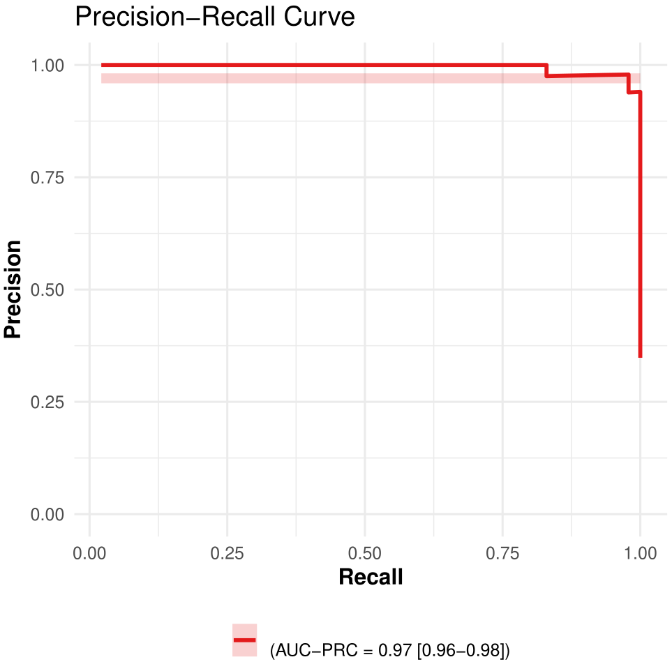

# pipeML

``` r
library(pipeML)
library(caret)
#> Loading required package: ggplot2
#> Loading required package: lattice
library(dplyr)
#> 
#> Attaching package: 'dplyr'
#> The following objects are masked from 'package:stats':
#> 
#>     filter, lag
#> The following objects are masked from 'package:base':
#> 
#>     intersect, setdiff, setequal, union
```

This tutorial demonstrates how to use the `pipeML` package for training
and testing machine learning models. It introduces the main functions of
the pipeline and guides you through additional functions for
visualization.

Load data

``` r
raw.counts = pipeML::raw.counts
traitData = pipeML::traitData
deconvolution = pipeML::deconvolution
```

## **Feature selection**

Apply repeated feature selection using the Boruta algorithm:

``` r
deconvolution$target = as.factor(traitData$Best.Confirmed.Overall.Response)
res_boruta <- feature.selection.boruta(
  data = deconvolution,
  iterations = 5,
  fix = FALSE,
  doParallel = FALSE,
  threshold = 0.8,
  file_name = "Test",
  return = FALSE
)
#> Running 5 iterations of the Boruta algorithm
#> 
#> Keeping only features confirmed in more than 0.8 of the times for training...............................................................
#> If you want to consider also tentative features, please specify tentative = TRUE in the parameters.
```

Inspect the results:

``` r
head(res_boruta$Matrix_Importance)
#> NULL

cat("Confirmed features:\n", res_boruta$Confirmed)
#> Confirmed features:

cat("Tentative features:\n", res_boruta$Tentative)
#> Tentative features:
```

To further assess tentative features, set `fix = TRUE` to rerun the
selection and confirm or reject them:

``` r
res_boruta <- feature.selection.boruta(
  data = deconvolution,
  iterations = 5,
  fix = TRUE,
  doParallel = FALSE,
  threshold = 0.8,
  file_name = "Test",
  return = FALSE
)
```

For faster execution, enable parallelization (ensure parameters
`doParallel` and `workers` are set):

``` r
res_boruta <- feature.selection.boruta(
  data = deconvolution,
  iterations = 10,
  fix = FALSE,
  doParallel = FALSE,
  workers = 2,
  threshold = 0.8,
  file_name = "Test",
  return = FALSE
)
```

## **Train Machine Learning models**

Train and tune models using repeated stratified k-fold cross-validation:

``` r
deconvolution = pipeML::deconvolution
traitData = pipeML::traitData
res <- compute_features.training.ML(features_train = deconvolution, 
                                    target_var = traitData$Best.Confirmed.Overall.Response,
                                    task_type = "classification",
                                    trait.positive = "CR",
                                    metric = "AUROC",
                                    stack = FALSE,
                                    k_folds = 2,
                                    n_rep = 2,
                                    LODO = FALSE,
                                    file_name = "Test",
                                    ncores = 2,
                                    return = FALSE)
```

Access the best-trained model:

``` r
res[[1]]$Model
```

View all trained and tuned machine learning models:

``` r
res[[1]]$ML_Models
```

``` r

```


Figure 1. Models training performance.

To apply model stacking, set `stack = TRUE`:

``` r
res <- compute_features.training.ML(features_train = deconvolution, 
                                    target_var = traitData$Best.Confirmed.Overall.Response,
                                    task_type = "classification",
                                    trait.positive = "CR",
                                    metric = "AUROC",
                                    stack = TRUE,
                                    k_folds = 2,
                                    n_rep = 2,
                                    LODO = FALSE,
                                    file_name = "Test",
                                    ncores = 2,
                                    return = FALSE)
```

Inspect the base models used in stacking:

``` r
res$Model$Base_models
```

Access the meta-learner:

``` r
res$Model$Meta_learner
```

## **Model prediction**

After training, users can predict on new data by using the
[`compute_prediction()`](https://verapancaldilab.github.io/pipeML/reference/compute_prediction.md)
function. You can specify which metric to maximize when determining the
optimal classification threshold. Supported values for maximize include:
“Accuracy”, “Precision”, “Recall”, “Specificity”, “Sensitivity”, “F1”,
and “MCC”.

``` r
pred = pipeML::compute_prediction(model = res, 
                                  test_data = testing_set, 
                                  target_var = traitData$Best.Confirmed.Overall.Response, 
                                  trait.positive = "CR", 
                                  file.name = "Test", 
                                  maximize = "Accuracy", 
                                  return = F)
```

If `return = TRUE`,
[`compute_prediction()`](https://verapancaldilab.github.io/pipeML/reference/compute_prediction.md)
will saved the RO and PR curves in the `Results/` directory. It can also
be retrieved with the following function

``` r
get_curves(pred$Metrics, spec = "Specificity", 
           sens = "Sensitivity", reca = "Recall", 
           prec = "Precision", color = "Cohort", 
           auc_roc = pred$AUC$AUROC, 
           auc_prc = pred$AUC$AUPRC, 
           file.name = "Test")
```

To enable parallelization, specify the number of cores via the `ncores`
parameter (default is `detectCores() - 1`).

``` r
res <- compute_features.training.ML(features_train = deconvolution, 
                                    target_var = traitData$Best.Confirmed.Overall.Response,
                                    task_type = "classification",
                                    trait.positive = "CR",
                                    metric = "AUROC",
                                    stack = TRUE,
                                    k_folds = 3,
                                    n_rep = 3,
                                    LODO = FALSE,
                                    file_name = "Test",
                                    ncores = 2,
                                    return = FALSE)
```

## **Train and predict using the machine learning models**

If you already have a separate testing dataset, you can directly train
the model and perform predictions using the following function. You can
also choose to optimize a specific metric to select a decision threshold
and return detailed prediction performance metrics such as Accuracy,
Sensitivity, Specificity, F1 score, MCC, Recall, and Precision.

``` r
deconvolution = pipeML::deconvolution
data_train = deconvolution[1:100,]
data_test = deconvolution[!rownames(deconvolution) %in% rownames(data_train),]
res <- compute_features.ML(features_train = data_train, 
                           features_test = data_test, 
                           clinical = traitData,
                           task_type = "classification",
                           trait = "Best.Confirmed.Overall.Response",
                           trait.positive = "CR",
                           metric = "AUROC",
                           stack = FALSE,
                           k_folds = 3,
                           n_rep = 3,
                           LODO = FALSE,
                           file_name = "Test",
                           maximize = "F1",
                           return = FALSE)
```

Access the prediction metrics:

``` r
head(res$Prediction_metrics)
```

To compute variable importance:

``` r
importance = compute_variable.importance(res$Model, 
                                         stacking = FALSE, 
                                         n_cores = 2)
```

And to visualize SHAP values:

``` r
plot_shap_values(importance, "glm", "shap_plot")
```

``` r

```


Figure 2. Variable importance.

## **Leaving one dataset out (LODO) analysis**

If your data includes features from multiple cohorts, pipeML provides a
flexible approach to perform Leave-One-Dataset-Out (LODO) analysis. This
is achieved by applying k-fold stratified sampling across batches,
ensuring that each fold preserves the batch structure while maintaining
class balance. For this set `LODO = TRUE` and provided column name
containing the batch information in the `batch_var` variable

Below, we demonstrate how to perform a LODO analysis using simulated
datasets:

Simulate datasets from different batches

``` r
set.seed(123)

# Simulate traitData with 3 cohorts
traitData <- data.frame(
  Sample = paste0("Sample", 1:90),
  Response = sample(c("R", "NR"), 90, replace = TRUE),
  Cohort = rep(paste0("Cohort", 1:3), each = 30),
  stringsAsFactors = FALSE
)
rownames(traitData) <- traitData$Sample

# Simulate counts matrix 
counts_all <- matrix(rnorm(1000 * 90), nrow = 1000, ncol = 90)
rownames(counts_all) <- paste0("Gene", 1:1000)
colnames(counts_all) <- traitData$Sample

# Simulate some example features 
features_all <- matrix(runif(90 * 15), nrow = 90, ncol = 15)
rownames(features_all) <- traitData$Sample
colnames(features_all) <- paste0("Feature", 1:15)
```

Perform LODO analysis

``` r
prediction = list()
i = 1
for (cohort in unique(traitData$Cohort)) {
    
  # Test cohort
  traitData_test = traitData %>%
    filter(Cohort == cohort)
  counts_test = counts_all[,colnames(counts_all)%in%rownames(traitData_test)]
  features_test = features_all[rownames(features_all)%in%rownames(traitData_test),]

  # Train cohort
  traitData_train = traitData %>%
    filter(Cohort != cohort)
  counts_train = counts_all[,colnames(counts_all)%in%rownames(traitData_train)]
  features_train = features_all[rownames(features_all)%in%rownames(traitData_train),]

  #### ML Training
  res = compute_features.training.ML(features_train = features_train, 
                                     target_var = traitData_train$Response, 
                                     task_type = "classification",
                                     trait.positive = "R", 
                                     metric = "AUROC", 
                                     stack = T, 
                                     k_folds = 2, 
                                     n_rep = 3, 
                                     LODO = TRUE,
                                     batch_var = traitData_train$Cohort, 
                                     ncores = 2, 
                                     return = F)

  ## Feature importance
  importance = compute_variable.importance(res, stacking = T, n_cores = 2)

  #### ML predicting
  
  #### Testing
  pred = compute_prediction(model = res, 
                            test_data = features_test, 
                            target_var = traitData_test$Response, 
                            trait.positive = "R", 
                            stack = TRUE, 
                            return = F)

  pred[["Importance"]] = importance
  
  #### Save results
  prediction[[i]] = pred
  names(prediction)[i] = cohort
  i = i + 1
}
```

For plotting we will make use of our `get_curves` function adapted in a
case for multiple cohorts.

``` r
metrics = list()
auroc = c() 
auprc = c()
for (i in 1:length(prediction)) {
  metrics[[i]] = prediction[[i]]$Metrics %>%
    dplyr::mutate(Cohort = names(prediction)[i], 
                  AUROC = rep(prediction[[i]]$AUC$AUROC, nrow(prediction[[i]]$Metrics)),
                  AUPRC = rep(prediction[[i]]$AUC$AUPRC, nrow(prediction[[i]]$Metrics))) %>%
    tibble::rownames_to_column("Samples") 
}
metrics = do.call(rbind, metrics)
metrics$Cohort = as.factor(metrics$Cohort)

get_curves(metrics, "Specificity", "Sensitivity", 
           "Recall", "Precision", "Cohort", 
           metrics$AUROC, metrics$AUPRC, "Test")
```

``` r
knitr::include_graphics("figures/ROC.png")
```


Figure 3. RO curves.

``` r

```


Figure 4. PR curves.

## **Custom k-fold cross validation**

In certain use cases it is essential to carefully design how the
training and test splits are created to prevent data leakage. `pipeML`
supports the use of custom fold construction functions via the
`fold_construction_fun` argument in the
[`compute_features.training.ML()`](https://verapancaldilab.github.io/pipeML/reference/compute_features.training.ML.md)
function. This allows you to preprocess your features within each fold,
ensuring that information from the test set is never used during
training.

#### Why use custom folds?

By default, cross-validation splits are performed directly on the
feature matrix. However, if your features are generated through a
process that uses correlations (e.g., clustering, dimensionality
reduction, aggregation), gene set enrichment or other features that are
sample-dependent, applying that process to the full dataset before
splitting can leak test-set information into the training set,
overfitting the models.

Using a custom fold construction function ensures that: - Test samples
are projected onto the learned space without influencing it. -
Fold-level processing mimics how the model would behave on truly unseen
data.

Below you can find an example of a custom fold function created to
compute TF activity in samples using the viper algorithm. This approach
is based on a TF-target set enrichment analysis similar to GSEA and
thus, the scores will be sample-dependent. It needs normalized counts as
input.

``` r
# These parameters are taking care inside pipeML automatically once `fold_construction_fun` is set. Be sure to not change the parameteres names.
#' @param data Data from which the custom function will be performed 
#' @param folds A list of integer vectors indicating row indices for the training set in each fold. 
#' 
prepare_TFs_folds <- function(data, folds) {
  
  processed_folds <- list()
  
  for (i in seq_along(folds)) {
    
    train_idx <- folds[[i]]
    test_idx <- setdiff(seq_len(nrow(data)), train_idx)
    
    ## Subset data
    train_data <- data[train_idx, , drop = FALSE]
    obs_train <- train_data$target
    train_data$target <- NULL
    
    ## Run TFs once
    train_processed <- compute_TF_activity(RNA_tpm = t(train_data)) ##################################################### User can change this part
    colnames(train_processed) <- gsub("[- +]", ".", colnames(train_processed)) ## Just to change special characters (ignore in other cases)
    
    train_cell_data <- train_processed %>%
      dplyr::mutate(target = obs_train)
    
    ## Prepare test data using trained info
    obs_test <- data$target[test_idx]
    test_data <- data[test_idx, , drop = FALSE]
    test_data$target <- NULL
    test_data <- compute_TF_activity(RNA_tpm = t(test_data)) ##################################################### User can change this part
    colnames(test_data) <- gsub("[- +]", ".", colnames(test_data)) ## Just to change special characters (ignore in other cases)
    
    processed_folds[[i]] <- list(
      train_data = train_cell_data,
      test_data = test_data,
      obs_test = obs_test,
      rowIndex = test_idx,
      fold_name = names(folds)[i]
    )
  }
  
  # Run TFs on the full training set
  obs_train = data$target
  data$target = NULL
  
  train_processed_final <- compute_TF_activity(RNA_tpm = t(data)) ##################################################### User can change this part
  colnames(train_processed_final) <- gsub("[- +]", ".", colnames(train_processed_final)) ## Just to change special characters (ignore in other cases)
  
  # Get features
  train_cell_data_final <- train_processed_final %>%
    dplyr::mutate(target = obs_train)
  
  custom_output = train_processed_final
  
  return(list(processed_folds, train_cell_data_final, custom_output))
}
```

In order to create your own custom fold function, user can follow the
same structure defined above and change the part highlighted in the
code. Once the function is ready you can provide it into the main
[`compute_features.training.ML()`](https://verapancaldilab.github.io/pipeML/reference/compute_features.training.ML.md)
function via the `fold_construction_fun` argument.

``` r
## counts_train: Normalized counts to compute the features from the training samples
## traitData_train: Target variable from the training samples

res = pipeML::compute_features.training.ML(as.data.frame(t(counts_train)), 
                                           traitData_train$Response, 
                                           trait.positive = "R", 
                                           metric = "AUROC", 
                                           stack = F, k_folds = 5, 
                                           n_rep = 10, LODO = F, 
                                           ncores = 2, return = F, 
                                           fold_construction_fun = prepare_TFs_folds)
```

In order to predict, user needs to calculate the same type of features
on the test set

``` r
## counts_test: Normalized counts to compute the features from the testing samples

tf_activities_test <- compute_TF_activity(RNA_tpm = counts_test)

# Predict in TFs
pred = compute_prediction(res, tf_activities_test, traitData_test$Response, trait.positive = "R", 
                          stack = FALSE, maximize = "Accuracy", return = F)
```

#### What if `fold_construction_fun` has multiple parameters?

Sometimes the feature construction function requires additional
arguments. For example, `compute_TF_activity()` may need the TF
collection, a minimum target size, and whether TFs should be pruned.
These can be exposed in your custom function:

``` r
tfs = compute.TFs.activity(counts.norm, TF.collection = "CollecTRI", min_targets_size = 5, tfs.pruned = FALSE)
```

Then the custom function needs to specify these parameters and their
values. It will look like this:

``` r
prepare_TFs_folds <- function(data, folds, TF.collection = "CollecTRI", min_targets_size = 5, tfs.pruned = FALSE) {
  
  processed_folds <- list()
  
  for (i in seq_along(folds)) {
    
    train_idx <- folds[[i]]
    test_idx <- setdiff(seq_len(nrow(data)), train_idx)
    
    ## Subset data
    train_data <- data[train_idx, , drop = FALSE]
    obs_train <- train_data$target
    train_data$target <- NULL
    
    ##################################################### User can change this part 
    train_processed <- compute_TF_activity(RNA_tpm = t(train_data),  
                                           TF.collection = "CollecTRI",
                                           min_targets_size = 5, 
                                           tfs.pruned = FALSE) 
    
    colnames(train_processed) <- gsub("[- +]", ".", colnames(train_processed)) ## Just to change special characters (ignore in other cases)
    
    train_cell_data <- train_processed %>%
      dplyr::mutate(target = obs_train)
    
    ## Prepare test data using trained info
    obs_test <- data$target[test_idx]
    test_data <- data[test_idx, , drop = FALSE]
    test_data$target <- NULL
    ##################################################### User can change this part
    test_data <- compute_TF_activity(RNA_tpm = t(test_data),
                                     TF.collection = "CollecTRI",
                                     min_targets_size = 5, 
                                     tfs.pruned = FALSE) 
    
    colnames(test_data) <- gsub("[- +]", ".", colnames(test_data)) ## Just to change special characters (ignore in other cases)
    
    processed_folds[[i]] <- list(
      train_data = train_cell_data,
      test_data = test_data,
      obs_test = obs_test,
      rowIndex = test_idx,
      fold_name = names(folds)[i]
    )
  }
  
  # Run TFs on the full training set
  obs_train = data$target
  data$target = NULL
  
  ##################################################### User can change this part
  train_processed_final <- compute_TF_activity(RNA_tpm = t(data),  
                                           TF.collection = "CollecTRI",
                                           min_targets_size = 5, 
                                           tfs.pruned = FALSE)  
  
  colnames(train_processed_final) <- gsub("[- +]", ".", colnames(train_processed_final)) ## Just to change special characters (ignore in other cases)
  
  # Get features
  train_cell_data_final <- train_processed_final %>%
    dplyr::mutate(target = obs_train)
  
  custom_output = train_processed_final
  
  return(list(processed_folds, train_cell_data_final, custom_output))
}
```

When calling
[`compute_features.training.ML()`](https://verapancaldilab.github.io/pipeML/reference/compute_features.training.ML.md),
these fixed arguments are passed via `fold_construction_args_fixed`:

``` r
res = pipeML::compute_features.training.ML(as.data.frame(t(counts_train)), 
                                           traitData_train$Response, 
                                           task_type = "classification",
                                           trait.positive = "R", 
                                           metric = "AUROC", 
                                           stack = F, k_folds = 5, 
                                           n_rep = 10, LODO = F, 
                                           ncores = 2, return = F, 
                                           fold_construction_fun = prepare_TFs_folds,
                                           fold_construction_args_fixed = list(TF.collection = "CollecTRI", 
                                                                               min_targets_size = 5, 
                                                                               tfs.pruned = FALSE))
```

#### Tunable hyperparameters during custom function

There will be cases when user will have parameters that can change value
and thus, affect the performance during training. pipeML implements a
custom hyperparameter tuning for these type of cases where the goal is
to find which value of a certain parameter maximizes the performance of
the model. Briefly, it takes a grid of values propose by the user and
compute custom k-folds for each combination of values, testing the
performance across different ML models and their corresponding
hyperparameters. It then returns the optimized parameters that return
the best performance across a certain number of iterations defined by
the user. For this, user needs to defined the parameter
`fold_construction_args_tunable` with the different values that should
be test. Here we want to test the performance using 5, 10, 15, 20 as
different values for this parameter.

``` r
res = pipeML::compute_features.training.ML(as.data.frame(t(counts_train)), 
                                           traitData_train$Response, 
                                           task_type = "classification",
                                           trait.positive = "R", 
                                           metric = "AUROC", 
                                           stack = F, k_folds = 5, 
                                           n_rep = 10, LODO = F, 
                                           ncores = 2, return = F, 
                                           fold_construction_fun = prepare_TFs_folds,
                                           fold_construction_args_fixed = list(TF.collection = "CollecTRI", tfs.pruned = FALSE), 
                                           fold_construction_args_tunable = list(min_targets_size = c(5, 10, 15, 20)))
```

For this to work, your custom function must accept a `bestune` argument,
which is used internally to inject the optimized parameter values found
during the tuning step.

When `bestune` is NULL, the function assumes that tuning has not yet
been performed. A grid of candidate parameter values (defined in
`fold_construction_args_tunable`) is generated. For each fold, the
function iterates through all combinations of parameter values and
recomputes the features. This exploration step is parallelized across
folds using foreach and doParallel, allowing multiple folds to be
processed simultaneously. Parallelization reduces runtime considerably
when the parameter grid or number of folds is large.

When `bestune` is not NULL, it means the tuning process has already been
completed. The optimized parameter values are extracted from the bestune
object. Features are then recomputed once on the full training dataset
using these tuned parameters. This ensures the final model is trained
with the best parameter setting identified during cross-validation.

In summary, the `bestune` argument acts as a control switch:

- NULL → run parameter search with parallelized fold-level evaluation.
- non-NULL → lock in the tuned parameter values and rebuild the features
  for final training.

This design allows a single custom fold-construction function to handle
both hyperparameter tuning (exploration, parallelized) and final model
preparation (exploitation, single optimized run).

``` r
prepare_TFs_folds <- function(data, folds, TF.collection = "CollecTRI", min_targets_size = 5, tfs.pruned = FALSE, bestune = NULL){
  
    if(!is.null(bestune)){
      
      obs_train = data$target
      data$target = NULL

      best_params <- bestune %>%
        dplyr::select(min_targets_size) ### Here you should put the hyperparameters that you want to tune 

      train_processed_final <- compute_TF_activity(RNA_tpm = t(test_data), 
                                                   TF.collection = "CollecTRI", 
                                                   min_targets_size = best_params$min_targets_size, ### Here you replace by the value of the optimized parameter
                                                   tfs.pruned = FALSE) 

      colnames(train_processed_final) <- gsub("[- +]", ".", colnames(train_processed_final)) ## Just to change special characters (ignore in other cases)

      # Get cell group features
      train_cell_data_final <- train_processed_final %>%
        dplyr::mutate(target = obs_train)
      
      custom_output = train_processed_final

      res = list(train_cell_data_final, custom_output, best_params)
    }else{ ### Means best tune need to be find

      #### Here put all the parameters you want to tune
      custom_grid <- expand.grid(
        min_targets_size = min_targets_size,
      )

      ### Implement parallelization
      if(is.null(ncores) == TRUE){
        ncores = parallel::detectCores() - 2
      }

      cl <- parallel::makeCluster(ncores)
      doParallel::registerDoParallel(cl)

      # Parallelize over folds
      processed_folds <- foreach::foreach(i = seq_along(folds), .packages = c("dplyr")) %dopar% {

        cat("Starting fold", names(folds)[i], "\n")

        train_idx <- folds[[i]]
        test_idx <- setdiff(seq_len(nrow(data)), train_idx)

        ## Subset data
        train_data <- data[train_idx, , drop = FALSE]
        train_coldata <- coldata[train_idx, , drop = FALSE]
        obs_train <- train_data$target
        train_data$target <- NULL

        fold_results <- vector("list", nrow(custom_grid))

        for (j in seq_len(nrow(custom_grid))) {

          ##################################################### User can change this part
          train_processed <- compute_TF_activity(RNA_tpm = t(train_data), 
                                                 TF.collection = "CollecTRI", 
                                                 min_targets_size = custom_grid$min_targets_size[j], ### Here will iterate across params values
                                                 tfs.pruned = FALSE) 

          colnames(train_processed) <- gsub("[- +]", ".", colnames(train_processed)) ## Just to change special characters (ignore in other cases)
          
          train_cell_data <- train_processed %>%
            dplyr::mutate(target = obs_train)

          ## Prepare test data using trained info
          obs_test <- data$target[test_idx]
          test_data <- data[test_idx, , drop = FALSE]
          test_data$target <- NULL
          ##################################################### User can change this part
          test_data <- compute_TF_activity(RNA_tpm = t(test_data), 
                                           TF.collection = "CollecTRI", 
                                           min_targets_size = custom_grid$min_targets_size[j], ### Here will iterate across params values
                                           tfs.pruned = FALSE) 
          
          colnames(test_data) <- gsub("[- +]", ".", colnames(test_data)) ## Just to change special characters (ignore in other cases)

          fold_results[[j]] <- list(
            train_data = train_cell_data,
            test_data  = test_data,
            obs_test   = obs_test,
            rowIndex   = test_idx,
            fold_name  = names(folds)[i],
            params     = custom_grid[j, ]
          )
        }

        fold_results
      }

      parallel::stopCluster(cl)  # stop the cluster after parallel execution
      unregister_dopar() #Stop Dopar from running in the background

      res <- processed_folds
    }

  return(res)
  
}
```
