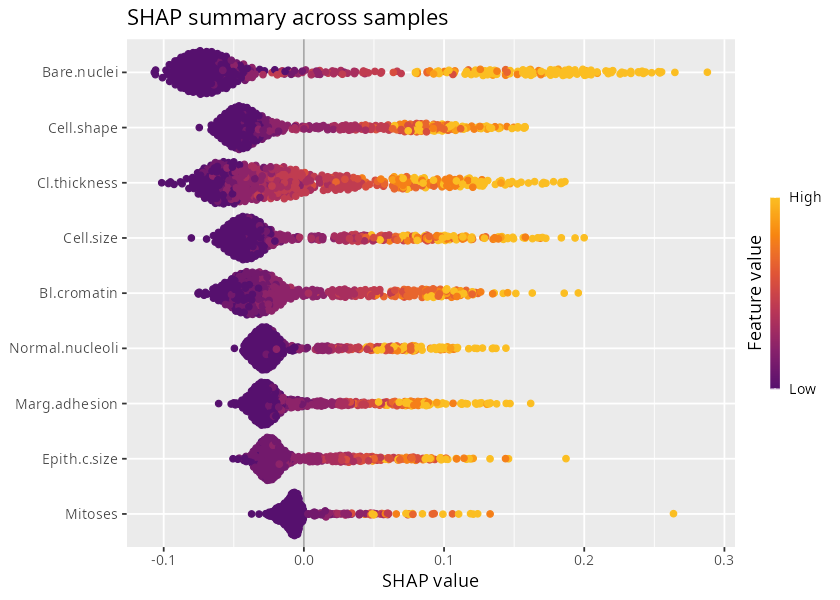
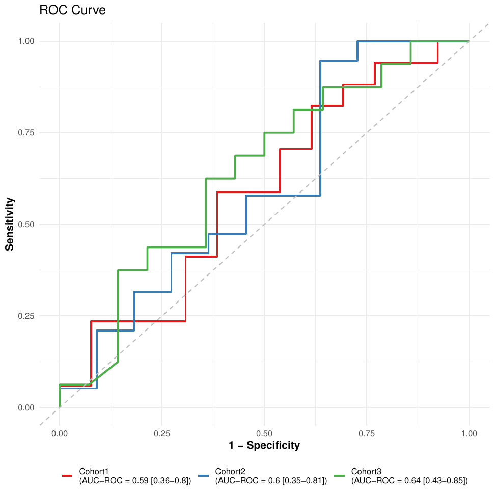
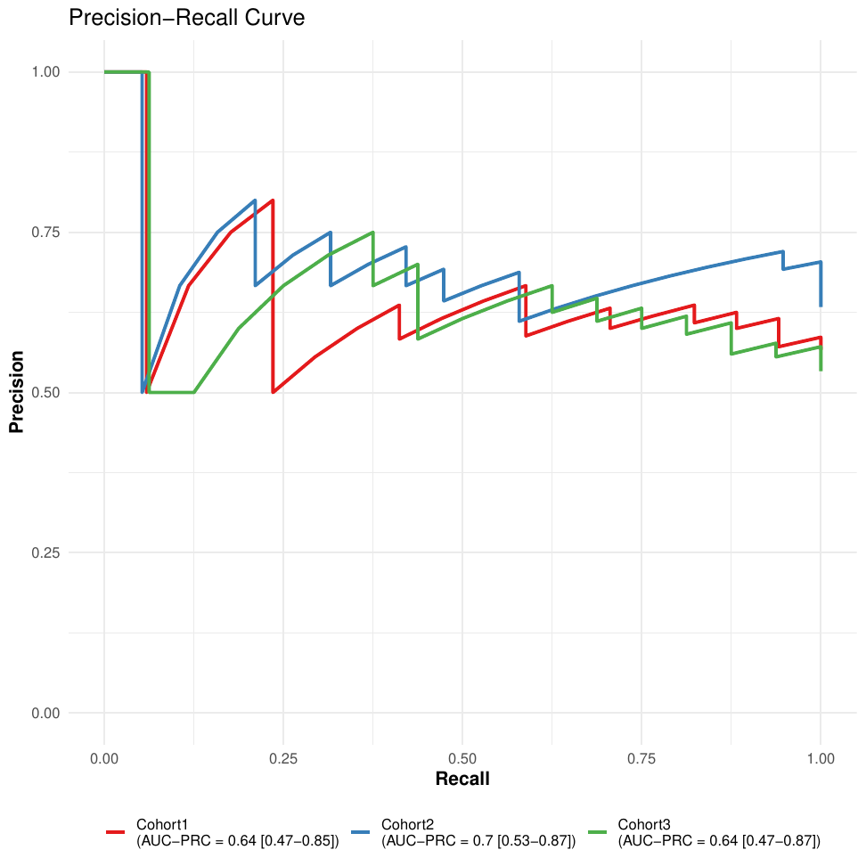

# pipeML

``` r

library(pipeML)
library(dplyr)
#> 
#> Attaching package: 'dplyr'
#> The following objects are masked from 'package:stats':
#> 
#>     filter, lag
#> The following objects are masked from 'package:base':
#> 
#>     intersect, setdiff, setequal, union
library(doParallel)  # also attaches foreach, used by the custom fold functions with tunable parameters
#> Loading required package: foreach
#> Loading required package: iterators
#> Loading required package: parallel
```

This vignette demonstrates how to use `pipeML` to train, tune, evaluate
and interpret machine learning models for classification and survival
tasks.

## Get Started

`pipeML` provides three core functions:

- [`compute_features.training.ML()`](https://verapancaldilab.github.io/pipeML/reference/compute_features.training.ML.md):
  train and tune models on a training set with repeated k-fold
  cross-validation, and select the best model.
- [`compute_prediction()`](https://verapancaldilab.github.io/pipeML/reference/compute_prediction.md):
  evaluate the selected model on a test set.
- [`compute_shap_values()`](https://verapancaldilab.github.io/pipeML/reference/compute_shap_values.md):
  explain the selected model with SHAP values computed on the
  cross-validation folds.

If you already have a test set prepared,
[`compute_features.ML()`](https://verapancaldilab.github.io/pipeML/reference/compute_features.ML.md)
performs training and prediction in one step.

### Which workflow should I use?

`pipeML` supports three ways of building the features used inside
cross-validation:

| Workflow | When to use it | Section |
|----|----|----|
| **Standard** | Your features are fixed values per sample (e.g. clinical variables, cell-type proportions computed per sample). | [Classification](#classification-tasks), [Survival](#survival-tasks) |
| **Custom folds, no tunable parameters** | Your features are computed from several samples at once (e.g. clustering, PCA, co-expression modules), so they must be recomputed inside each fold to avoid leakage. | [Custom folds](#leakage-aware-custom-cross-validation) |
| **Custom folds with tunable parameters** | As above, and the feature construction has parameters you want to tune (e.g. number of components, module size). | [Tunable parameters](#tunable-parameters-within-custom-fold-functions) |

All three workflows work for both classification and survival tasks, and
all of them support prediction on a test set and SHAP values.

Results (plots, fold models) are written to a `Results/` folder in the
working directory.

## Classification Tasks

Load example data:

``` r

data = pipeML::data_example_classification
X <- data %>% dplyr::select(-target)
y <- data$target
```

For this example, make a train/test split:

``` r

set.seed(123)

train_idx <- caret::createDataPartition(y, p = 0.7, list = FALSE)

X_train <- X[train_idx, ]
X_test  <- X[-train_idx, ]

y_train <- y[train_idx]
y_test  <- y[-train_idx]
```

### Train Models

Train and tune models using repeated stratified k-fold cross-validation.
`trait.positive` is the value of `target_var` considered as the positive
class, and `metric` is the metric used to select the best model
(`"AUROC"`, `"AUPRC"` or `"Accuracy"`):

``` r

res <- compute_features.training.ML(features_train = X_train,
                                    target_var = y_train,
                                    task_type = "classification",
                                    trait.positive = "1",
                                    metric = "AUROC",
                                    k_folds = 2,
                                    n_rep = 1,
                                    ncores = 2,
                                    seed = 123,
                                    file_name = "Example_classification",
                                    return = FALSE)
```

Access the best-trained model:

``` r

res$Model
```

View all trained and tuned machine learning models:

``` r

names(res$ML_Models)
```

`res$AUROC_median` and `res$AUPRC_median` compare the cross-validation
performance of all the algorithms. The cross-validation performance of
the selected model, per resample, is in `res$Model$resample`:

``` r

res$AUROC_median
head(res$Model$resample)
```


Figure 1. Models training performance.

### Predict On Test Data

After training, predict on new data with
[`compute_prediction()`](https://verapancaldilab.github.io/pipeML/reference/compute_prediction.md).
The test data must contain the same features used for training:

``` r

pred = compute_prediction(model = res$Model,
                          test_data = X_test,
                          target_var = y_test,
                          task_type = "classification",
                          trait.positive = "1",
                          file.name = "Example_classification")
```

AUROC and AUPRC on the test set, with bootstrap confidence intervals:

``` r

pred$AUC
```

Check predictions:

``` r

head(pred$Predictions)
```

Inspect threshold-based prediction metrics:

``` r

head(pred$Metrics)
```

If `return = TRUE`,
[`compute_prediction()`](https://verapancaldilab.github.io/pipeML/reference/compute_prediction.md)
saves ROC and PR curves in the `Results/` directory.


Figure 2. ROC curve.


Figure 3. PR curve.

### Compute SHAP Values

SHAP values explain which features drive the predictions of the selected
model (see [Interpreting models with SHAP
values](#interpreting-models-with-shap-values) for details and plots).
Everything
[`compute_shap_values()`](https://verapancaldilab.github.io/pipeML/reference/compute_shap_values.md)
needs (training data, outcome, cross-validation folds, tuned
hyperparameters) is taken from the trained model, so only the model
needs to be passed:

``` r

shap_classification <- compute_shap_values(model_trained = res$Model,
                                           task_type = "classification",
                                           n_cores = 2,
                                           seed = 123)
head(shap_classification)
```

## Survival Tasks

In addition to classification, `pipeML` supports survival analysis,
allowing users to train machine learning models that predict
time-to-event outcomes.

In survival analysis, the response variable is defined by two
components:

- **Time**: follow-up or survival time
- **Event**: indicator of whether the event occurred (1) or the
  observation was censored (0)

**Note:** survival models are built on the `censored` extension of
`parsnip`. It must be installed, but you don’t need to load it —
`pipeML` loads it automatically when a survival task runs.

``` r

install.packages("censored")  # only needed once, if not already installed
```

Load example dataset for survival. In this dataset
([`survival::lung`](https://rdrr.io/pkg/survival/man/lung.html)),
`status` is coded 1 = censored and 2 = death, so we recode it as 0/1:

``` r

data = pipeML::data_example_survival
X <- data %>% dplyr::select(-time, -status)
time <- data$time
event <- ifelse(data$status == 2, 1, 0)
```

Similar to the previous example, split data into train/test:

``` r

set.seed(123)
train_idx <- caret::createDataPartition(event, p = 0.7, list = FALSE)

X_train <- X[train_idx, ]
X_test  <- X[-train_idx, ]

time_train <- time[train_idx]
time_test  <- time[-train_idx]

event_train <- event[train_idx]
event_test  <- event[-train_idx]
```

### Train Models

The function
[`compute_features.training.ML()`](https://verapancaldilab.github.io/pipeML/reference/compute_features.training.ML.md)
can also train survival models by setting `task_type = "survival"`. The
best model is selected by the concordance index (C-index):

``` r

res_survival <- compute_features.training.ML(
  features_train = X_train,
  task_type = "survival",
  time_var = time_train,
  event_var = event_train,
  k_folds = 2,
  n_rep = 1,
  file_name = "Example_survival",
  ncores = 2
)
```

Access the best model:

``` r

names(res_survival$ML_Models)
res_survival$Model$model
res_survival$Model$Model_object
```

Check training metrics:

``` r

res_survival$C_index_median
head(res_survival$Model$Prediction_folds)
```


Figure 4. Models training performance.

### Predict On Test Data

After training, predictions can be generated using
[`compute_prediction()`](https://verapancaldilab.github.io/pipeML/reference/compute_prediction.md).

``` r

pred_survival <- compute_prediction(
  model = res_survival$Model,
  test_data = X_test,
  task_type = "survival",
  time_var = time_test,
  event_var = event_test,
  file.name = "Example_survival")

pred_survival$c_index
```

Unlike classification models, survival models may return different types
of predictions depending on the model used. Some models predict a risk
score, while others predict expected survival time or survival
probability.

The
[`compute_prediction()`](https://verapancaldilab.github.io/pipeML/reference/compute_prediction.md)
function automatically handles these differences. Internally, it
attempts several prediction types and converts them into a standardized
risk score so that results can be compared across models:

- Risk score (**linear_pred**) – typically produced by Cox models.
  Higher values indicate higher predicted risk.
- Predicted survival time (**time**) – produced by some parametric
  survival models. Higher values indicate longer survival, so the values
  are internally reversed to represent risk.
- Survival probability (**survival**) – probability of surviving at a
  given time point. Higher probabilities correspond to lower risk, so
  these values are also internally reversed.

After this standardization step, predictions are always interpreted in
the same way:

**Higher prediction values correspond to higher predicted risk**

This allows `pipeML` to compute performance metrics such as the
concordance index (C-index) and to stratify patients into risk groups
for Kaplan–Meier visualization (saved in `Results/` when
`return = TRUE`).


Figure 5. KM plot.

### Compute SHAP Values

[`compute_shap_values()`](https://verapancaldilab.github.io/pipeML/reference/compute_shap_values.md)
works the same way with `task_type = "survival"`. The training data is
taken from the trained model (`res_survival$Model$trainingData`), so
only the model needs to be passed. SHAP values are in risk-score units:
positive values push the prediction towards higher risk.

``` r

shap_survival <- compute_shap_values(model_trained = res_survival$Model,
                                     task_type = "survival",
                                     n_cores = 2)
head(shap_survival)
```

## One-Step Training and Prediction

If a separate testing dataset is already available,
[`compute_features.ML()`](https://verapancaldilab.github.io/pipeML/reference/compute_features.ML.md)
trains the models (with hyperparameter tuning and model selection on the
training data) and then applies the selected model to the test data in a
single step. The outcome is read from `coldata`, whose row names must be
the sample names of the feature tables.

### Classification Example

``` r

data = pipeML::data_example_classification
X <- data %>% dplyr::select(-target)
y <- data$target

set.seed(123)

train_idx <- caret::createDataPartition(y, p = 0.8, list = FALSE)

X_train <- X[train_idx, ]
X_test  <- X[-train_idx, ]
```

``` r

res_onestep <- compute_features.ML(features_train = X_train,
                                   features_test = X_test,
                                   coldata = data,
                                   task_type = "classification",
                                   trait = "target",
                                   trait.positive = "1",
                                   metric = "AUROC",
                                   k_folds = 2,
                                   n_rep = 1,
                                   ncores = 2,
                                   file_name = "Test",
                                   return = FALSE)
res_onestep$AUC
```

### Survival Example

``` r

data = pipeML::data_example_survival
data$event <- ifelse(data$status == 2, 1, 0)   # 1 = death, 0 = censored
X <- data %>% dplyr::select(-time, -status, -event)

set.seed(123)
train_idx <- caret::createDataPartition(data$event, p = 0.7, list = FALSE)

X_train <- X[train_idx, ]
X_test  <- X[-train_idx, ]
```

``` r

res_onestep_survival <- compute_features.ML(features_train = X_train,
                                            features_test = X_test,
                                            coldata = data,
                                            task_type = "survival",
                                            time_var = "time",
                                            event_var = "event",
                                            k_folds = 2,
                                            n_rep = 1,
                                            ncores = 2,
                                            file_name = "Test",
                                            return = FALSE)
res_onestep_survival$C_index
```

## Interpreting Models with SHAP Values

### What are SHAP values?

SHAP (SHapley Additive exPlanations) values quantify how much each
feature contributed to pushing a given prediction away from the average
prediction. They are grounded in cooperative game theory: each feature
is treated as a “player”, and its SHAP value represents its fair share
of the prediction.

For a single sample, SHAP values decompose the prediction as:

    prediction(sample) = average prediction + SHAP(feature_1) + SHAP(feature_2) + ... + SHAP(feature_p)

A positive SHAP value means the feature pushed the prediction above
average; a negative value means the opposite. The SHAP values of a
sample always sum to the difference between its prediction and the
average prediction.

SHAP values are in the units of the model output:

- **Classification**: probability of the positive class. A SHAP value of
  0.05 means the feature raised the predicted probability by 5
  percentage points.
- **Survival**: risk score. Positive values push towards higher risk.

### How are SHAP values computed?

`pipeML` uses the `fastshap` package, which estimates SHAP values via
Monte Carlo sampling (100 simulations per feature). For each sample and
each feature, it asks: *on average, across random orderings of the
features, how much does including this feature change the prediction?*
When a feature is “absent”, it is replaced by the value of a randomly
drawn training sample.

### Per-fold SHAP: why `pipeML` does it differently

Most SHAP workflows fit one final model on all data and compute SHAP
values on training samples. This has a bias: the model already memorized
those samples, so features that overfit will appear more important than
they really are.

`pipeML` instead computes SHAP values **per cross-validation fold**:

1.  For each resample, take the model trained on the training part of
    that fold (with the tuned hyperparameters).
2.  Compute SHAP values only on the held-out samples of that fold —
    samples the model never saw.
3.  After all folds, aggregate SHAP values per sample via the median
    across resamples.

How the fold model is obtained depends on the workflow:

- **Standard workflow**: the fold model is refitted on the training part
  of the fold.
- **Custom folds**: the fold models are saved during training (in
  `fold_models_dir`, by default `Results/fold_models/<task_type>`) and
  loaded by
  [`compute_shap_values()`](https://verapancaldilab.github.io/pipeML/reference/compute_shap_values.md).
  They cannot be refitted, because their features were built from the
  training part of each fold. If a fold model is missing,
  [`compute_shap_values()`](https://verapancaldilab.github.io/pipeML/reference/compute_shap_values.md)
  stops with an error: point `fold_models_dir` to the directory used
  during training, or retrain the model.

[`compute_shap_values()`](https://verapancaldilab.github.io/pipeML/reference/compute_shap_values.md)
prints how many resamples were loaded, refitted or skipped (a resample
is skipped when the model predicts the same value for all its held-out
samples).

### Running `compute_shap_values()`

We use the classification model trained above (`res`, trained on
`data_example_classification`). With `return_resamples = TRUE`, the
function also returns the SHAP values of each resample:

``` r

shap_res <- compute_shap_values(model_trained = res$Model,
                                task_type = "classification",
                                n_cores = 2,
                                return_resamples = TRUE)
```

`shap_res$shap` has one row per training sample and one column per
feature. Each value is the median SHAP value of the sample across the
resamples in which it was held out:

``` r

shap_classification <- shap_res$shap
head(shap_classification)
```

`shap_res$shap_resamples` has one row per held-out sample and resample:

``` r

head(shap_res$shap_resamples)
```

### Feature importance across samples

The global importance of a feature is its mean absolute SHAP value
across samples:

``` r

sort(colMeans(abs(shap_classification)), decreasing = TRUE)
```

The `shapviz` package provides standard SHAP plots. It needs the SHAP
values and the feature values of the same samples, which are in the
training data stored in the model:

``` r

X_shap <- res$Model$trainingData[rownames(shap_classification), colnames(shap_classification)]

sv <- shapviz::shapviz(as.matrix(shap_classification), X = X_shap)
```

Global feature importance (bar plot):

``` r

shapviz::sv_importance(sv, kind = "bar") +
  ggplot2::ggtitle("Global feature importance")
```


Figure 6. Global feature importance (mean \|SHAP\|).

Beeswarm plot: each point is a sample, placed by its SHAP value and
coloured by its feature value. It shows both the importance and the
direction of the effect (e.g. whether high values of a feature increase
or decrease the prediction):

``` r

shapviz::sv_importance(sv, kind = "beeswarm") +
  ggplot2::ggtitle("SHAP summary across samples")
```



Figure 7. SHAP values of all samples.

Dependence plot: SHAP value of a feature against its value, for the most
important feature:

``` r

top_feature <- names(sort(colMeans(abs(shap_classification)), decreasing = TRUE))[1]
shapviz::sv_dependence(sv, v = top_feature)
```


Figure 8. SHAP dependence plot of the most important feature.

### SHAP values of a single sample

A waterfall plot shows how the features of one sample move its
prediction away from the average prediction. Because `pipeML` takes the
median of each sample’s SHAP values across resamples, the plot starts
from 0 (`E[f(x)]=0`) instead of the average predicted probability:
`f(x)` is the total change in predicted probability for that sample, and
each bar is the contribution of one feature:

``` r

shapviz::sv_waterfall(sv, row_id = 1) +
  ggplot2::ggtitle(paste("Sample", rownames(shap_classification)[1]))
```


Figure 9. SHAP values of one sample (waterfall plot).

The same information as a force plot:

``` r

shapviz::sv_force(sv, row_id = 1)
```


Figure 10. SHAP values of one sample (force plot).

### Stability of feature importance across resamples

[`plot_shap_stability()`](https://verapancaldilab.github.io/pipeML/reference/plot_shap_stability.md)
shows, for each feature, the mean and standard deviation across
resamples of its per-resample importance (mean \|SHAP\| over the
held-out samples of each resample). Features with a large standard
deviation are important in some folds only:

``` r

plot_shap_stability(shap_res$shap_resamples, top_n = 20)
```


Figure 11. Stability of feature importance across resamples.

Setting `file.name` in
[`compute_shap_values()`](https://verapancaldilab.github.io/pipeML/reference/compute_shap_values.md)
or
[`plot_shap_stability()`](https://verapancaldilab.github.io/pipeML/reference/plot_shap_stability.md)
also saves this plot as
`Results/SHAP_stability_resample_<file.name>.pdf`.

The same plots can be made for survival models, using
`res_survival$Model$trainingData` for the feature values.

## Advanced

### Leave-One-Dataset-Out (LODO) Analysis

If your data includes features from multiple cohorts, `pipeML` provides
a flexible approach to perform **Leave-One-Dataset-Out (LODO)
analysis**. This is achieved by applying k-fold stratified sampling
across batches, ensuring that each fold preserves the batch structure
while maintaining class balance. To enable this, set `LODO = TRUE` and
provide the batch of each sample in `batch_var`.

Below, we demonstrate how to perform a LODO analysis using simulated
datasets:

Simulate datasets from different batches (‘cohorts’)

``` r

set.seed(123)

# Simulate traitData with 3 cohorts
traitData <- data.frame(
  Sample = paste0("Sample", 1:90),
  Response = sample(c("R", "NR"), 90, replace = TRUE),
  Cohort = rep(paste0("Cohort", 1:3), each = 30),
  stringsAsFactors = FALSE
)
rownames(traitData) <- traitData$Sample

# Simulate some example features
features_all <- matrix(runif(90 * 15), nrow = 90, ncol = 15)
rownames(features_all) <- traitData$Sample
colnames(features_all) <- paste0("Feature", 1:15)
```

Leave each cohort out in turn: train on the other cohorts and predict
the left-out one

``` r

prediction = list()
for (cohort in unique(traitData$Cohort)) {

  # Test cohort
  traitData_test = traitData %>% filter(Cohort == cohort)
  features_test = features_all[rownames(traitData_test), ]

  # Train cohorts
  traitData_train = traitData %>% filter(Cohort != cohort)
  features_train = features_all[rownames(traitData_train), ]

  #### ML Training
  res_lodo = compute_features.training.ML(features_train = features_train,
                                          target_var = traitData_train$Response,
                                          task_type = "classification",
                                          trait.positive = "R",
                                          metric = "AUROC",
                                          k_folds = 2,
                                          n_rep = 1,
                                          LODO = TRUE,
                                          batch_var = traitData_train$Cohort,
                                          ncores = 2,
                                          return = FALSE)

  #### Testing
  prediction[[cohort]] = compute_prediction(model = res_lodo$Model,
                                            test_data = features_test,
                                            target_var = traitData_test$Response,
                                            task_type = "classification",
                                            trait.positive = "R",
                                            return = FALSE)
}
```

For plotting, we use
[`get_curves()`](https://verapancaldilab.github.io/pipeML/reference/get_curves.md),
adapted for multiple cohorts. This function is used internally by
[`compute_prediction()`](https://verapancaldilab.github.io/pipeML/reference/compute_prediction.md)
to generate ROC and PR curves.

Extract prediction metrics and join

``` r

roc_data <- lapply(names(prediction), function(cohort) {
  df <- prediction[[cohort]]$Metrics
  df$cohort <- cohort
  df
}) %>% dplyr::bind_rows()

auc_roc <- list(
  estimate = sapply(prediction, function(x) x$AUC$AUROC$estimate),
  lower = sapply(prediction, function(x) x$AUC$AUROC$lower),
  upper = sapply(prediction, function(x) x$AUC$AUROC$upper)
)

auc_prc <- list(
  estimate = sapply(prediction, function(x) x$AUC$AUPRC$estimate),
  lower = sapply(prediction, function(x) x$AUC$AUPRC$lower),
  upper = sapply(prediction, function(x) x$AUC$AUPRC$upper)
)
```

Plot ROC and PR curves:

``` r

get_curves(
  data = roc_data,
  color = "cohort",
  auc_roc = auc_roc,
  auc_prc = auc_prc,
  LODO = TRUE,
  file.name = "LODO_cohort_example",
  width = 9,
  height = 9
)
```



Figure 12. LODO ROC curves.



Figure 13. LODO PR curves.

### Leakage-Aware Custom Cross-Validation

A central design principle of `pipeML` is to prevent information leakage
during model training and evaluation. In many machine learning
workflows, feature engineering steps are applied to the full dataset
before cross-validation, which can inadvertently introduce information
from the test folds into the training process. This leads to
overoptimistic performance estimates.

To address this, `pipeML` provides built-in support for custom fold
construction through the `fold_construction_fun` argument in
[`compute_features.training.ML()`](https://verapancaldilab.github.io/pipeML/reference/compute_features.training.ML.md).
This mechanism allows feature engineering and preprocessing steps to be
recomputed independently within each cross-validation fold, ensuring
that test samples never influence the training process.

This capability is a core component of the `pipeML` pipeline, enabling
**leakage-aware model** development for datasets where features depend
on the full sample structure.

#### Why custom fold construction is important?

In many biological and high-dimensional datasets, features are not
independent variables but are derived from the data itself. Examples
include:

- correlation-based clustering
- dimensionality reduction (e.g., PCA)
- gene set enrichment or pathway scoring
- transcription factor activity inference
- aggregation of features across samples

If these transformations are applied to the entire dataset before
cross-validation, the test samples influence how the feature space is
constructed. As a result, the model indirectly “sees” information from
the test data during training.

By recomputing these steps within each fold, `pipeML` ensures that:

- training data are used to define the feature space
- test samples are projected onto the learned space without influencing
  it
- model evaluation reflects true out-of-sample performance

This approach closely mimics how the model would behave when applied to
completely unseen data, producing more realistic performance estimates.

Inside each fold, `pipeML` also removes near-constant and highly
correlated features (\|r\| \> 0.9) from the features built on the
training part, and keeps the same features in the held-out part.

#### Step 1 - Define a base feature function

**Structure of the Base Feature Function**

The function is designed around two operational modes:

- **Training Mode** (structure is `NULL`): The function learns the
  feature structure from the input dataset.
- **Projection Mode** (structure provided): The function applies a
  previously learned structure to new data.

**Why the function returns two objects?**

- **features** → always returned; the transformed representation of the
  current dataset (training or test).
- **structure** → the learned structure; needed to project test data in
  future steps.

This ensures a leakage-aware workflow:

- Training data defines the feature space.
- Test data is projected without altering the learned structure.

Structure of base function

- **data**: features as rows, samples as columns
- **structure**: precomputed structure (e.g., clusters, components);
  `NULL` for training
- **…**: additional arguments specific to the algorithm used

``` r

compute_features_modular <- function(data, structure = NULL, ...) {

  # TRAINING MODE
  if (is.null(structure)) {

    # -------------------- REPLACE THIS BLOCK --------------------
    structure <- learn_structure(data, ...) # user-defined function
    # -------------------- REPLACE THIS BLOCK --------------------

  }

  # PROJECT MODE

  # -------------------- REPLACE THIS BLOCK --------------------
  features <- project_data(data, structure, ...) # user-defined function
  # -------------------- REPLACE THIS BLOCK --------------------

  return(list(features = features, structure = structure))
}
```

Here we illustrate a correlation-based feature computation using
**Weighted Gene Co-expression Network Analysis (WGCNA)**: genes are
grouped into co-expression modules on the training samples, and each
module is summarized by the first principal component of its genes. This
is just an example: in practice, you can use any feature computation
that depends on multiple samples, such as clustering, PCA, among others.

``` r

library(WGCNA)
compute_features_modular <- function(counts, power = NULL, modules = NULL) {

  ## Just preprocessing (IGNORE)
  rownames(counts) <- gsub("-", ".", rownames(counts))
  datExpr <- t(counts)
  cor <- WGCNA::cor

  # TRAINING MODE
  if (is.null(modules)) {

    # -------------------- REPLACE THIS BLOCK --------------------
    net <- WGCNA::blockwiseModules(datExpr, power = power)
    modules <- net$colors
    names(modules) <- colnames(datExpr)
    # -------------------- REPLACE THIS BLOCK --------------------

  }

  # PROJECT MODE

  # -------------------- REPLACE THIS BLOCK --------------------
  module_features <- sapply(sort(unique(modules)), function(mod) {
    genes <- names(modules[modules == mod])
    pc <- prcomp(datExpr[, genes, drop = FALSE])
    pc$x[, 1]
  })
  # -------------------- REPLACE THIS BLOCK --------------------

  ## Just formatting (IGNORE)
  colnames(module_features) <- paste0("Module_", sort(unique(modules)))

  return(list(features = as.matrix(module_features), structure = modules))
}
```

#### Step 2 - Make the function suitable for `pipeML`

We then need to extend and give the correct format to this function to
make it suitable for running across folds inside `pipeML`.

This template provides a modular framework to prepare cross-validation
folds for `pipeML` in a leakage-aware way. It separates training vs
projection:

- **Training mode**: computes features and learns the data structure
  from the training folds
- **Projection mode**: applies the learned structure to held-out folds
  without influencing it.

Users can easily adapt this template by replacing their previous
`compute_features_modular` function.

##### **NOTE**

In `pipeML` data corresponds to samples as rows and features as columns.
If your `compute_features_modular()` needs features as rows, make sure
to [`t()`](https://rdrr.io/r/base/t.html) inside this function.

The parameters `data`, `folds`, and `bestune` are handled by `pipeML`
automatically once `fold_construction_fun` is set. Do not change these
parameter names or remove them.

- **data**: the training features. For classification, it also contains
  the outcome in a `target` column.
- **folds**: named list with the training rows of each fold.
- **bestune**: `NULL` while running the folds; set by `pipeML` when
  building the features of the final model (see
  [below](#why-do-we-need-bestune-argument-even-if-i-dont-have-hyperparams-in-my-function)).
- **…** : Additional parameters passed to your feature function

The function must:

- in fold mode (`bestune = NULL`), save each fold as
  `Results/fold_<fold name>.rds`, with the training features (plus the
  outcome), the test features, the observed test outcome, the test row
  indices (`rowIndex`) and the fold name.
- in final mode (`bestune` not `NULL`), return a list with the features
  of all training samples (plus the outcome), any output you want to
  keep (available as `res$Custom_output`) and `bestune`.

Make sure `compute_features_modular()` returns a matrix with the
features. If not, make sure to extract them before adding the target
column.

``` r

prepare_custom_folds <- function(data, folds = NULL, bestune = NULL, ...) {

  if (!is.null(bestune)) {

    obs_train <- data$target
    data$target <- NULL

    # -------------------- REPLACE THIS BLOCK --------------------
    result <- compute_features_modular(data, ...)
    # -------------------- REPLACE THIS BLOCK --------------------

    train_features_final = as.data.frame(result$features)
    train_features_final$target <- obs_train

    custom_output <- result

    return(list(train_features_final, custom_output, bestune))

  } else {

    processed_folds <- list()

    for (i in seq_along(folds)) {

      train_idx <- folds[[i]]
      test_idx  <- setdiff(seq_len(nrow(data)), train_idx)

      train_data <- data[train_idx, , drop = FALSE]
      obs_train <- train_data$target
      train_data$target <- NULL

      # -------------------- REPLACE THIS BLOCK --------------------
      train_result <- compute_features_modular(train_data, ...)
      # -------------------- REPLACE THIS BLOCK --------------------

      train_features = as.data.frame(train_result$features)
      train_features$target <- obs_train

      test_data <- data[test_idx, , drop = FALSE]
      obs_test <- test_data$target
      test_data$target <- NULL

      # -------------------- REPLACE THIS BLOCK --------------------
      test_features <- compute_features_modular(
        test_data,
        structure = train_result$structure,
        ...
      )
      # -------------------- REPLACE THIS BLOCK --------------------

      test_features = as.data.frame(test_features$features)

      processed_folds[[i]] <- list(
        train_data = train_features,
        test_data  = test_features,
        obs_test   = obs_test,
        rowIndex   = test_idx,
        fold_name  = names(folds)[i]
      )
    }

    for (i in seq_along(processed_folds)) {
      filename <- file.path("Results", paste0("fold_", names(folds)[i], ".rds"))
      saveRDS(processed_folds[[i]], file = filename)
    }

    return(processed_folds)
  }
}
```

Here we illustrate how the function will look applying our
`compute_features_modular()` function.

Notice that each time I call the function `compute_features_modular()` I
am setting my additional argument `power`:

``` r

prepare_WGCNA_folds <- function(data, folds = NULL, bestune = NULL, power) {

  if (!is.null(bestune)) {

    obs_train <- data$target
    data$target <- NULL

    # -------------------- REPLACE THIS BLOCK --------------------
    wgcna_result <- compute_features_modular(t(data), power = power)
    # -------------------- REPLACE THIS BLOCK --------------------

    train_cell_data_final <- as.data.frame(wgcna_result$features)
    train_cell_data_final$target <- obs_train

    custom_output <- wgcna_result

    return(list(train_cell_data_final, custom_output, bestune))

  } else {

    processed_folds <- list()

    for (i in seq_along(folds)) {

      train_idx <- folds[[i]]
      test_idx  <- setdiff(seq_len(nrow(data)), train_idx)

      train_data <- data[train_idx, , drop = FALSE]
      obs_train <- train_data$target
      train_data$target <- NULL

      # -------------------- REPLACE THIS BLOCK --------------------
      train_result <- compute_features_modular(t(train_data), power = power)
      # -------------------- REPLACE THIS BLOCK --------------------

      train_features <- as.data.frame(train_result$features)
      train_features$target <- obs_train

      test_data <- data[test_idx, , drop = FALSE]
      obs_test <- test_data$target
      test_data$target <- NULL

      # -------------------- REPLACE THIS BLOCK --------------------
      test_features <- compute_features_modular(t(test_data),
                                                modules = train_result$structure)
      # -------------------- REPLACE THIS BLOCK --------------------

      test_features <- as.data.frame(test_features$features)

      processed_folds[[i]] <- list(
        train_data = train_features,
        test_data  = test_features,
        obs_test   = obs_test,
        rowIndex   = test_idx,
        fold_name  = names(folds)[i]
      )
    }

    for (i in seq_along(processed_folds)) {
      filename <- file.path("Results", paste0("fold_", names(folds)[i], ".rds"))
      saveRDS(processed_folds[[i]], file = filename)
    }

    return(processed_folds)
  }
}
```

Load data example. `counts_example` contains genes as rows and samples
as columns; we keep the samples annotated in `coldata_example`, in the
same order:

``` r

coldata = pipeML::coldata_example
counts = pipeML::counts_example[, rownames(coldata)]

set.seed(123)

train_idx <- caret::createDataPartition(coldata$Response, p = 0.7, list = FALSE)

counts_train <- counts[, train_idx]
counts_test  <- counts[, -train_idx]

coldata_train <- coldata[train_idx, , drop = FALSE]
coldata_test  <- coldata[-train_idx, , drop = FALSE]
```

#### Step 3 - Run custom k-fold cross-validation

Once your custom fold function is ready, pass it to
[`compute_features.training.ML()`](https://verapancaldilab.github.io/pipeML/reference/compute_features.training.ML.md)
via `fold_construction_fun`.

The argument `fold_construction_args_fixed` corresponds to the
additional parameters of your fold function (in this example `power` in
`prepare_WGCNA_folds()`), set to the value to use. If your function does
not have any additional parameters, you can omit this argument.

``` r

res_custom <- compute_features.training.ML(features_train = t(counts_train),
                                           target_var     = coldata_train$Response,
                                           task_type      = "classification",
                                           trait.positive = "R",
                                           metric         = "AUROC",
                                           k_folds        = 2,
                                           n_rep          = 1,
                                           ncores         = 2,
                                           return         = FALSE,
                                           fold_construction_fun        = prepare_WGCNA_folds,
                                           fold_construction_args_fixed = list(power = 6))
```

Notice that `res_custom$Custom_output` contains the output of your base
function on the full training set, in case it is needed (e.g. for
prediction - see next step):

``` r

names(res_custom$Custom_output)
head(res_custom$Custom_output$features)
head(res_custom$Custom_output$structure)
```

During cross-validation, the model of each fold is saved in
`fold_models_dir` (by default `Results/fold_models/classification` or
`Results/fold_models/survival`), and only the files of the selected
model are kept. They are used by
[`compute_shap_values()`](https://verapancaldilab.github.io/pipeML/reference/compute_shap_values.md).
If you run several analyses of the same task from the same working
directory, give each one its own `fold_models_dir` and pass the same
directory to
[`compute_shap_values()`](https://verapancaldilab.github.io/pipeML/reference/compute_shap_values.md).

#### Step 4 - Prediction on test data

To apply the model to new data, compute the same type of features,
projecting the test samples on the structure learned from the training
set (here, the WGCNA modules):

``` r

test = compute_features_modular(counts_test, modules = res_custom$Custom_output$structure)
test_features = test$features
```

Prediction

``` r

pred_custom <- compute_prediction(model = res_custom$Model,
                                  test_data = test_features,
                                  target_var = coldata_test$Response,
                                  task_type = "classification",
                                  trait.positive = "R",
                                  file.name = "Custom_fold")
pred_custom$AUC
```

#### Step 5 - SHAP values

The fold models saved during training are loaded, so no argument other
than the model is needed:

``` r

shap_custom <- compute_shap_values(model_trained = res_custom$Model,
                                   task_type = "classification",
                                   n_cores = 2)
head(shap_custom)
```

#### Tunable parameters within custom fold functions

In some scenarios, the feature construction step may include parameters
whose values can influence model performance. For example, when
computing WGCNA, parameters such as `soft-thresholding power`,
`minimum module size`, `module merging threshold`, and
`module splitting sensitivity` may affect the resulting features and
therefore the downstream model performance.

To address this, `pipeML` supports hyperparameter tuning within your
custom fold functions. This allows users to identify which parameter
values lead to the best predictive performance.

Briefly, the user provides a grid of candidate parameter values, and
`pipeML` will:

- construct custom cross-validation folds for each parameter combination
- train and evaluate machine learning models for each configuration
- compare the resulting performance across folds and repetitions
- return the parameter values that maximize the selected performance
  metric

Before that, user needs to modify `compute_features_modular` and
`prepare_custom_folds()` to account for all these parameters.

For the `compute_features_modular` we are only going to add the tunable
parameters in our function call:

``` r

compute_features_modular <- function(
    counts,
    power = NULL,
    modules = NULL,
    ## tunable parameters
    minModuleSize = 20,
    mergeCutHeight = 0.15,
    deepSplit = 2
) {

  ## Just preprocessing (IGNORE)
  rownames(counts) <- gsub("-", ".", rownames(counts))
  datExpr <- t(counts)
  cor <- WGCNA::cor

  # TRAINING MODE

  if (is.null(modules)) {

    # -------------------- REPLACE THIS BLOCK --------------------
    net <- WGCNA::blockwiseModules(
      datExpr,
      power = power,
      minModuleSize = minModuleSize,
      mergeCutHeight = mergeCutHeight,
      deepSplit = deepSplit
    )
    modules <- net$colors
    names(modules) <- colnames(datExpr)
    # -------------------- REPLACE THIS BLOCK --------------------

  }

  # PROJECT MODE

  # -------------------- REPLACE THIS BLOCK --------------------
  module_features <- sapply(sort(unique(modules)), function(mod) {
    genes <- names(modules[modules == mod])
    pc <- prcomp(datExpr[, genes, drop = FALSE])
    pc$x[, 1]
  })
  # -------------------- REPLACE THIS BLOCK --------------------

  ## Just formatting (IGNORE)
  colnames(module_features) <- paste0("Module_", sort(unique(modules)))

  return(list(features = as.matrix(module_features), structure = modules))
}
```

Then we will use this version of `prepare_custom_folds()`, modified to
account for the parameter combinations. Compared to the version without
tunable parameters:

- in fold mode, each `Results/fold_<fold name>.rds` file contains a list
  with one element per parameter combination, and each element also
  stores the combination in `params`.
- in final mode, the selected values are read from `bestune`, and the
  function returns them (as a data frame) as the third element.

Notice we have an additional parameter `ncores` that controls
parallelization when evaluating all runs (**do not remove it!**).

``` r

prepare_custom_folds_tuning <- function(data,
                                        folds = NULL,
                                        bestune = NULL,
                                        ncores = NULL, ...){

  if (!is.null(bestune)) {

    obs_train <- data$target
    data$target <- NULL

    # -------------------- REPLACE THIS BLOCK --------------------
    required_cols <- c() # list your params separated by a comma
    # -------------------- REPLACE THIS BLOCK --------------------

    best_params <- if (is.data.frame(bestune)) {
      if (all(required_cols %in% names(bestune))) {
        dplyr::select(bestune, dplyr::all_of(required_cols))
      }else{stop("Not all tunable params found. Verify your function.")}
    } else if (is.list(bestune)) {
      if (all(required_cols %in% names(bestune))) {
        tibble::as_tibble(bestune[required_cols])
      }else{stop("Not all tunable params found. Verify your function.")}
    } else {
      stop("`bestune` must be a data.frame or list.")
    }

    # -------------------- REPLACE THIS BLOCK --------------------
    res_final <- compute_features_modular(
      counts = data,
      # change param1, param2, ... for the names of your parameters
      param1 = best_params$param1,
      param2 = best_params$param2,
      param3 = best_params$param3,
      ...
    )
    # -------------------- REPLACE THIS BLOCK --------------------

    train_features_final = as.data.frame(res_final$features)
    train_features_final$target <- obs_train

    custom_output <- res_final

    return(list(train_features_final, custom_output, best_params))

  } else {

    # -------------------- REPLACE THIS BLOCK --------------------
    custom_grid <- expand.grid(
      param1 = param1,
      param2 = param2,
      param3 = param3,
      ...,
      stringsAsFactors = FALSE
    )
    # -------------------- REPLACE THIS BLOCK --------------------

    if (is.null(ncores)) ncores <- parallel::detectCores() - 2
    cl <- parallel::makeCluster(ncores)
    doParallel::registerDoParallel(cl)

    processed_folds <- foreach::foreach(i = seq_along(folds),
                                        .packages = c("dplyr"),
                                        .export = c("compute_features_modular")
                                       ) %dopar% {

      train_idx <- folds[[i]]
      test_idx  <- setdiff(seq_len(nrow(data)), train_idx)

      train_data <- data[train_idx, , drop = FALSE]
      obs_train <- train_data$target
      train_data$target <- NULL

      fold_results <- lapply(seq_len(nrow(custom_grid)), function(j) {
        params <- custom_grid[j, , drop = FALSE]

        # -------------------- REPLACE THIS BLOCK --------------------
        res_train <- compute_features_modular(
          counts = train_data,
          param1 = params$param1,
          param2 = params$param2,
          param3 = params$param3,
          ...
        )
        # -------------------- REPLACE THIS BLOCK --------------------

        train_features <- as.data.frame(res_train$features)
        train_features$target <- obs_train

        test_data <- data[test_idx, , drop = FALSE]
        obs_test <- test_data$target
        test_data$target <- NULL

        # -------------------- REPLACE THIS BLOCK --------------------
        test_features <- compute_features_modular(
          test_data,
          structure = res_train$structure,
          ...
        )
        # -------------------- REPLACE THIS BLOCK --------------------

        test_features = as.data.frame(test_features$features)

        list(
          train_data = train_features,
          test_data  = test_features,
          obs_test   = obs_test,
          rowIndex   = test_idx,
          fold_name  = names(folds)[i],
          params     = params
        )
      })

      filename <- file.path("Results", paste0("fold_", names(folds)[i], ".rds"))
      saveRDS(fold_results, file = filename)

      fold_results
    }

    parallel::stopCluster(cl)
    foreach::registerDoSEQ()
    gc()

  }
}
```

In our case it would be:

``` r

prepare_WGCNA_folds_modular <- function(
    data,
    folds = NULL,
    bestune = NULL,
    power = NULL,
    ncores = NULL,
    ### tunable parameters
    minModuleSize,
    mergeCutHeight,
    deepSplit
) {

  if (!is.null(bestune)) {

    obs_train <- data$target
    data$target <- NULL

    # -------------------- REPLACE THIS BLOCK --------------------
    required_cols <- c("minModuleSize", "mergeCutHeight", "deepSplit")
    # -------------------- REPLACE THIS BLOCK --------------------

    best_params <- if (is.data.frame(bestune)) {
      if (all(required_cols %in% names(bestune))) {
        dplyr::select(bestune, dplyr::all_of(required_cols))
      }else{stop("Not all tunable params found. Verify your function.")}
    } else if (is.list(bestune)) {
      if (all(required_cols %in% names(bestune))) {
        tibble::as_tibble(bestune[required_cols])
      }else{stop("Not all tunable params found. Verify your function.")}
    } else {
      stop("`bestune` must be a data.frame or list.")
    }

    # -------------------- REPLACE THIS BLOCK --------------------
    res_final <- compute_features_modular(
      counts = t(data),
      power = power,
      ## tunable parameters
      minModuleSize = best_params$minModuleSize,
      mergeCutHeight = best_params$mergeCutHeight,
      deepSplit = best_params$deepSplit
    )
    # -------------------- REPLACE THIS BLOCK --------------------

    train_cell_data_final <- as.data.frame(res_final$features)
    train_cell_data_final$target <- obs_train

    custom_output <- res_final

    return(list(train_cell_data_final, custom_output, best_params))

  } else {

    # -------------------- REPLACE THIS BLOCK --------------------
    custom_grid <- expand.grid(
      minModuleSize = minModuleSize,
      mergeCutHeight = mergeCutHeight,
      deepSplit = deepSplit,
      stringsAsFactors = FALSE
    )
    # -------------------- REPLACE THIS BLOCK --------------------

    if (is.null(ncores)) ncores <- parallel::detectCores() - 2
    cl <- parallel::makeCluster(ncores)
    doParallel::registerDoParallel(cl)

    processed_folds <- foreach::foreach(i = seq_along(folds),
                                        .packages = c("dplyr"),
                                        .export = c("compute_features_modular")
                                        ) %dopar% {

      train_idx <- folds[[i]]
      test_idx <- setdiff(seq_len(nrow(data)), train_idx)

      train_data <- data[train_idx, , drop = FALSE]
      obs_train <- train_data$target
      train_data$target <- NULL

      fold_results <- lapply(seq_len(nrow(custom_grid)), function(j) {

        params <- custom_grid[j, , drop = FALSE]

        # -------------------- REPLACE THIS BLOCK --------------------
        wgcna_train <- compute_features_modular(
          counts = t(train_data),
          power = power,
          ## tunable parameters
          minModuleSize = params$minModuleSize,
          mergeCutHeight = params$mergeCutHeight,
          deepSplit = params$deepSplit
        )
        # -------------------- REPLACE THIS BLOCK --------------------

        train_features <- as.data.frame(wgcna_train$features)
        train_features$target <- obs_train

        test_data <- data[test_idx, , drop = FALSE]
        obs_test <- test_data$target
        test_data$target <- NULL

        # -------------------- REPLACE THIS BLOCK --------------------
        wgcna_test <- compute_features_modular(
          counts = t(test_data),
          modules = wgcna_train$structure
        )
        # -------------------- REPLACE THIS BLOCK --------------------

        test_features <- as.data.frame(wgcna_test$features)

        list(
          train_data = train_features,
          test_data = test_features,
          obs_test = obs_test,
          rowIndex = test_idx,
          fold_name = names(folds)[i],
          params = params
        )
      })

      filename <- file.path("Results", paste0("fold_", names(folds)[i], ".rds"))
      saveRDS(fold_results, file = filename)

      fold_results
    }

    parallel::stopCluster(cl)
    foreach::registerDoSEQ()
    gc()

  }
}
```

To enable this functionality, the user must specify the argument
`fold_construction_args_tunable`, which contains the set of parameter
values to be evaluated.

The argument `fold_construction_args_fixed` corresponds to the
additional parameters of the fold function that are not tunable (in our
case `power` and `ncores`). These parameters have the same value across
all runs (**fixed**). Be sure of setting `ncores` to a value that your
computer can handle to avoid crashing.

The tunable parameters define the search space explored during feature
computation. The total number of configurations corresponds to all
combinations of the provided parameter values. In this example:

- `minModuleSize` = c(20, 50) → 2 values
- `mergeCutHeight` = 0.25 → 1 value
- `deepSplit` = c(1, 2) → 2 values

This results in **2 × 1 × 2 = 4** feature parameter combinations.

For each of these configurations, the machine learning models are
trained and tuned. For example, if logistic regression with elastic net
(`glmnet`) is used, the model internally evaluates different values of
the hyperparameters `alpha` and `lambda`. If the model tests **10 alpha
values and 20 lambda values**, this results in **200 model
configurations** for each feature combination, so **4 × 200 = 800**
model fits, further multiplied by the number of folds and repetitions.
Larger grids are possible, but the running time grows accordingly.

``` r

res_params <- compute_features.training.ML(features_train = t(counts_train),
                                           target_var     = coldata_train$Response,
                                           task_type = "classification",
                                           trait.positive = "R",
                                           metric = "AUROC",
                                           k_folds = 2,
                                           n_rep = 1,
                                           ncores = 2,
                                           return = FALSE,
                                           fold_construction_fun = prepare_WGCNA_folds_modular,
                                           fold_construction_args_fixed = list(power = 6,
                                                                               ncores = 2),
                                           fold_construction_args_tunable = list(
                                             minModuleSize = c(20, 50),
                                             mergeCutHeight = 0.25,
                                             deepSplit = c(1, 2)
                                           ))
```

`pipeML` will automatically train the model with the combination of
parameters which maximizes the metric chosen. The selected parameters
are in `res_params$Custom_output$Parameters`:

``` r

res_params$Custom_output$Parameters
```

Prediction on the test set works as without tunable parameters,
projecting the test samples on the modules learned with the selected
parameters:

``` r

test_params <- compute_features_modular(counts_test, modules = res_params$Custom_output$structure)

pred_params <- compute_prediction(model = res_params$Model,
                                  test_data = test_params$features,
                                  target_var = coldata_test$Response,
                                  task_type = "classification",
                                  trait.positive = "R")
pred_params$AUC
```

SHAP values are computed on the fold models built with the selected
parameters:

``` r

shap_params <- compute_shap_values(model_trained = res_params$Model,
                                   task_type = "classification",
                                   n_cores = 2)
head(shap_params)
```

#### Custom folds for survival tasks

Custom fold functions work the same way for survival tasks, with two
differences:

- `data` contains only the features: pass the survival time and event to
  your fold function through `fold_construction_args_fixed`.
- the training and test features of each fold, and the training features
  returned in final mode, must contain the outcome in two columns named
  `time` and `event` (instead of `target`).

Here we build features with a principal component analysis (PCA) learned
on the training samples, on the survival example data. First, the base
feature function:

``` r

compute_pca_features <- function(data, n_comp = 2, structure = NULL) {

  # TRAINING MODE: learn the principal components
  if (is.null(structure)) {
    structure <- prcomp(data, center = TRUE, scale. = TRUE)
  }

  # PROJECT MODE: project the samples on the learned components
  features <- predict(structure, newdata = data)[, seq_len(n_comp), drop = FALSE]

  return(list(features = as.data.frame(features), structure = structure))
}
```

Data, with the event recoded as 0/1:

``` r

data = pipeML::data_example_survival
X <- data %>% dplyr::select(-time, -status)
time <- data$time
event <- ifelse(data$status == 2, 1, 0)

set.seed(123)
train_idx <- caret::createDataPartition(event, p = 0.7, list = FALSE)

X_train <- X[train_idx, ]
X_test  <- X[-train_idx, ]
time_train <- time[train_idx]
time_test  <- time[-train_idx]
event_train <- event[train_idx]
event_test  <- event[-train_idx]
```

**Without tunable parameters.** The number of components is fixed, and
`time` and `event` are passed as fixed arguments:

``` r

prepare_PCA_folds <- function(data, folds = NULL, bestune = NULL, time, event, n_comp = 2) {

  if (!is.null(bestune)) {
    # Final mode: features of all training samples
    result <- compute_pca_features(data, n_comp = n_comp)
    train_features <- result$features
    train_features$time <- time
    train_features$event <- event
    return(list(train_features, result, bestune))
  }

  # Fold mode
  for (i in seq_along(folds)) {
    train_idx <- folds[[i]]
    test_idx  <- setdiff(seq_len(nrow(data)), train_idx)

    train_result <- compute_pca_features(data[train_idx, , drop = FALSE], n_comp = n_comp)
    train_features <- train_result$features
    train_features$time <- time[train_idx]
    train_features$event <- event[train_idx]

    test_features <- compute_pca_features(data[test_idx, , drop = FALSE], n_comp = n_comp,
                                          structure = train_result$structure)$features
    test_features$time <- time[test_idx]
    test_features$event <- event[test_idx]

    saveRDS(list(train_data = train_features, test_data = test_features, rowIndex = test_idx),
            file.path("Results", paste0("fold_", names(folds)[i], ".rds")))
  }
}
```

``` r

res_pca <- compute_features.training.ML(features_train = X_train,
                                        task_type = "survival",
                                        time_var = time_train,
                                        event_var = event_train,
                                        k_folds = 2,
                                        n_rep = 1,
                                        ncores = 2,
                                        fold_construction_fun = prepare_PCA_folds,
                                        fold_construction_args_fixed = list(time = time_train,
                                                                            event = event_train,
                                                                            n_comp = 5))
```

Prediction: project the test samples on the components learned on the
training set, then predict:

``` r

test_pca <- compute_pca_features(X_test, n_comp = 5, structure = res_pca$Custom_output$structure)

pred_pca <- compute_prediction(model = res_pca$Model,
                               test_data = test_pca$features,
                               task_type = "survival",
                               time_var = time_test,
                               event_var = event_test)
pred_pca$c_index
```

SHAP values:

``` r

shap_pca <- compute_shap_values(model_trained = res_pca$Model,
                                task_type = "survival",
                                n_cores = 2)
head(shap_pca)
```

**With tunable parameters.** Here the number of components is tuned. As
for classification, each fold file contains one element per candidate
value (with the value in `params`), and in final mode the selected value
is read from `bestune` and returned as the third element:

``` r

prepare_PCA_folds_tuning <- function(data, folds = NULL, bestune = NULL, time, event, n_comp) {

  if (!is.null(bestune)) {
    # Final mode: features of all training samples with the selected number of components
    best_n_comp <- bestune$n_comp[1]
    result <- compute_pca_features(data, n_comp = best_n_comp)
    train_features <- result$features
    train_features$time <- time
    train_features$event <- event
    return(list(train_features, result, data.frame(n_comp = best_n_comp)))
  }

  # Fold mode: one element per candidate number of components
  for (i in seq_along(folds)) {
    train_idx <- folds[[i]]
    test_idx  <- setdiff(seq_len(nrow(data)), train_idx)

    fold_results <- lapply(n_comp, function(k) {
      train_result <- compute_pca_features(data[train_idx, , drop = FALSE], n_comp = k)
      train_features <- train_result$features
      train_features$time <- time[train_idx]
      train_features$event <- event[train_idx]

      test_features <- compute_pca_features(data[test_idx, , drop = FALSE], n_comp = k,
                                            structure = train_result$structure)$features
      test_features$time <- time[test_idx]
      test_features$event <- event[test_idx]

      list(train_data = train_features, test_data = test_features, rowIndex = test_idx,
           params = data.frame(n_comp = k))
    })

    saveRDS(fold_results, file.path("Results", paste0("fold_", names(folds)[i], ".rds")))
  }
}
```

``` r

res_pca_tuning <- compute_features.training.ML(features_train = X_train,
                                               task_type = "survival",
                                               time_var = time_train,
                                               event_var = event_train,
                                               k_folds = 2,
                                               n_rep = 1,
                                               ncores = 2,
                                               fold_construction_fun = prepare_PCA_folds_tuning,
                                               fold_construction_args_fixed = list(time = time_train,
                                                                                   event = event_train),
                                               fold_construction_args_tunable = list(n_comp = c(3, 5)))

res_pca_tuning$Custom_output$Parameters   # selected number of components
```

Prediction with the selected number of components, and SHAP values:

``` r

best_n_comp <- res_pca_tuning$Custom_output$Parameters$n_comp
test_pca_tuning <- compute_pca_features(X_test, n_comp = best_n_comp,
                                        structure = res_pca_tuning$Custom_output$structure)

pred_pca_tuning <- compute_prediction(model = res_pca_tuning$Model,
                                      test_data = test_pca_tuning$features,
                                      task_type = "survival",
                                      time_var = time_test,
                                      event_var = event_test)
pred_pca_tuning$c_index

shap_pca_tuning <- compute_shap_values(model_trained = res_pca_tuning$Model,
                                       task_type = "survival",
                                       n_cores = 2)
head(shap_pca_tuning)
```

#### Why do we need `bestune` argument even if I don’t have hyperparams in my function?

For this to work, your custom function must accept a `bestune` argument,
which is used internally to inject the optimized parameter values found
during the tuning step.

When `bestune` is `NULL`, the function assumes that tuning has not yet
been performed. A grid of candidate parameter values (defined in
`fold_construction_args_tunable`) is generated. For each fold, the
function iterates through all combinations of parameter values and
recomputes the features. This exploration step can be parallelized
across folds using `foreach` and `doParallel`, allowing multiple folds
to be processed simultaneously. Parallelization reduces runtime
considerably when the parameter grid or number of folds is large.

When `bestune` is not `NULL`, it means the tuning process has already
been completed. The optimized parameter values are extracted from the
`bestune` object. Features are then recomputed once on the full training
dataset using these tuned parameters. This ensures the final model is
trained with the best parameter setting identified during
cross-validation.

In summary, the `bestune` argument acts as a control switch:

- `NULL` → build the features of each cross-validation fold (for each
  parameter combination, if any).
- `non-NULL` → lock in the tuned parameter values and rebuild the
  features for final training.

This design allows a single custom fold-construction function to handle
both hyperparameter tuning (exploration, parallelized) and final model
preparation (exploitation, single optimized run). Without tunable
parameters, `bestune` is still used as this switch between fold mode and
final mode.

## **References**

`pipeML` is built on top of existing frameworks and makes extensive use
of the R packages `caret`, `tidymodels`, `parsnip`, and `censored`. If
you use `pipeML` in your work, please cite our package along with these
foundational packages.
