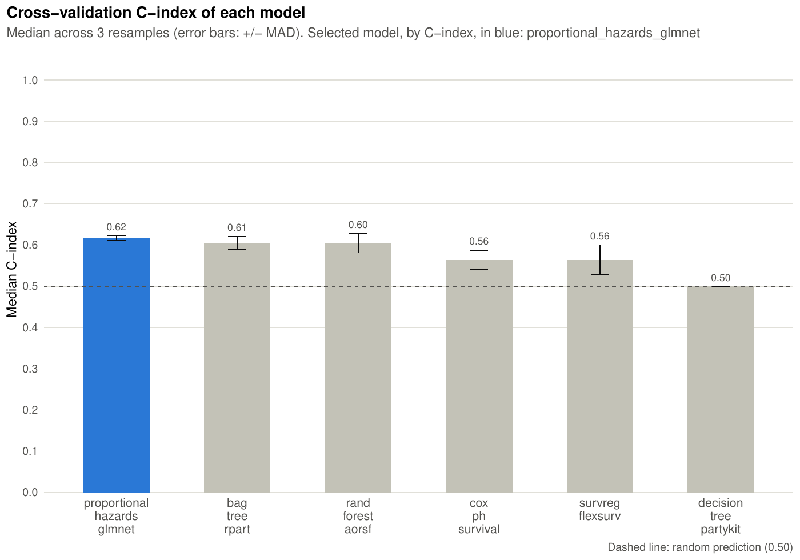
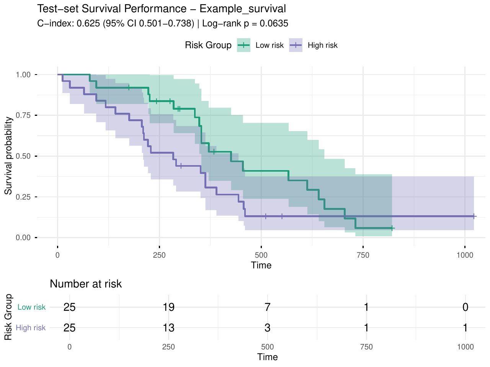
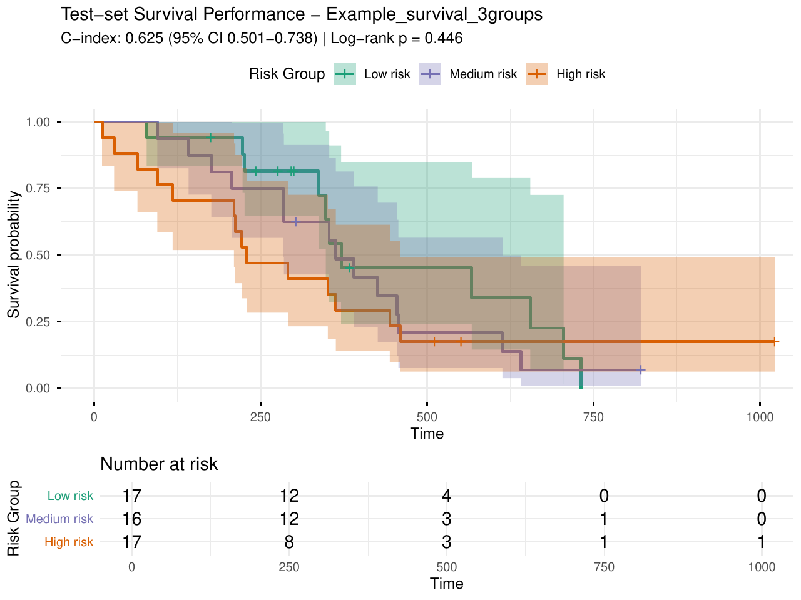

```{r, include = FALSE}
knitr::opts_chunk$set(
  collapse = TRUE,
  comment = "#>"
)
```

```{r setup}
library(pipeML)
library(dplyr)
```

## **Survival outcomes**

`pipeML` also trains models that predict time-to-event outcomes. The outcome has two components:

- **time**: follow-up or survival time
- **event**: whether the event occurred (1) or the observation was censored (0). It must be coded with these two values, without missing values.

Survival models are built with `parsnip` and its `censored` extension. `censored` must be installed, but you don't need to load it: `pipeML` loads it when a survival task runs.

```{r, eval=FALSE}
install.packages("censored")  # only needed once
```

## **Data**

`data_example_survival` is the lung cancer dataset of the `survival` package: survival `time` in days, event indicator `status` (1 = death, 0 = censored) and 8 covariates.

```{r, eval=FALSE}
data <- pipeML::data_example_survival
X <- data %>% dplyr::select(-time, -status)
time <- data$time
event <- data$status
```

Split the samples into a training and a test set, stratified by event:

```{r, eval=FALSE}
set.seed(123)
train_idx <- caret::createDataPartition(event, p = 0.7, list = FALSE)

X_train <- X[train_idx, ]
X_test  <- X[-train_idx, ]
time_train <- time[train_idx]
time_test  <- time[-train_idx]
event_train <- event[train_idx]
event_test  <- event[-train_idx]
```

## **Train models**

With `task_type = "survival"`, `compute_features.training.ML()` trains and tunes six survival models (Cox proportional hazards, elastic-net Cox, parametric accelerated failure time model, conditional inference tree, bagged CART and oblique random survival forest) with repeated k-fold cross-validation stratified by event. `time_var` and `event_var` are the time and event of each training sample. The best model is selected by the concordance index (C-index).

As for classification, near-constant and highly correlated features (|r| > 0.9) are removed from the training features before the cross-validation (`preprocess = TRUE`, the default); none of the features of this example is removed.

Survival models are slower to train than classification models: here we use 3 folds and 1 repetition to keep the example fast. Use more folds and repetitions (e.g. `k_folds = 5`, `n_rep = 5`) for real analyses.

```{r, eval = FALSE}
res_survival <- compute_features.training.ML(features_train = X_train,
                                             task_type = "survival",
                                             time_var = time_train,
                                             event_var = event_train,
                                             k_folds = 3,
                                             n_rep = 1,
                                             ncores = 2,
                                             seed = 123,
                                             file_name = "Example_survival",
                                             return = TRUE)
```

All trained models and the name of the selected one:

```{r, eval = FALSE}
names(res_survival$ML_Models)
unique(res_survival$Model$Resample_matrix$model)
```

The selected model trained on all training samples with the tuned hyperparameters (a fitted `workflows` object), and those hyperparameters:

```{r, eval = FALSE}
res_survival$Model$Model_object
res_survival$Model$bestTune
```

Cross-validation performance: median C-index of the selected model, and its C-index per resample:

```{r, eval = FALSE}
res_survival$C_index_median
head(res_survival$Model$Resample_matrix)
```

With `return = TRUE`, the C-index of all models across resamples is saved in `Results/` (named with `file_name`).

```{r fig1, echo = FALSE, fig.cap="Figure 1. Cross-validation C-index of the trained models.", fig.align='center', out.width='80%'}

```

## **Predict on test data**

```{r, eval = FALSE}
pred_survival <- compute_prediction(model = res_survival$Model,
                                    test_data = X_test,
                                    task_type = "survival",
                                    time_var = time_test,
                                    event_var = event_test,
                                    file.name = "Example_survival",
                                    return = TRUE)
```

C-index on the test set, with its 95% confidence interval:

```{r, eval = FALSE}
pred_survival$c_index
c(pred_survival$c_index_lower, pred_survival$c_index_upper)
```

Predicted risk scores of the test samples:

```{r, eval = FALSE}
head(pred_survival$preds)
```

Depending on the model, survival models predict a linear predictor, a survival time or a survival probability. The modelling library (`parsnip`) returns all of them so that higher values mean longer survival. `compute_prediction()` reverses them into a risk score so that all models are read the same way:

- linear predictor (**linear_pred**), e.g. Cox models: `parsnip` returns it with the sign changed (higher = longer survival), so it is reversed back into a risk score;
- predicted survival time (**time**), e.g. tree-based models, is reversed: a longer survival means a lower risk;
- survival probability (**survival**) is also reversed: a higher probability of survival means a lower risk.

**Higher prediction values always correspond to higher predicted risk.**

## **Kaplan-Meier curves by risk group**

With `return = TRUE`, `compute_prediction()` splits the test samples into two groups at the median predicted risk and saves their Kaplan-Meier curves in `Results/` (`Survival_KM_<file.name>.pdf`), with the C-index and the log-rank test p-value. The **High risk** group contains the samples with the highest predicted risk scores, so its curve is expected to drop faster than the one of the **Low risk** group.

```{r fig2, echo = FALSE, fig.cap="Figure 2. Kaplan-Meier curves of the test samples by predicted risk group (two groups).", fig.align='center', out.width='80%'}

```

The number of groups is set with `n_groups` (default 2). Groups are defined by quantiles of the predicted risk and are named Low/High risk (2 groups), Low/Medium/High risk (3 groups) or Group 1 (lowest risk) to Group n (highest risk):

```{r, eval = FALSE}
pred_survival <- compute_prediction(model = res_survival$Model,
                                    test_data = X_test,
                                    task_type = "survival",
                                    time_var = time_test,
                                    event_var = event_test,
                                    file.name = "Example_survival_3groups",
                                    return = TRUE,
                                    n_groups = 3)
```

```{r fig3, echo = FALSE, fig.cap="Figure 3. Kaplan-Meier curves of the test samples by predicted risk group (three groups).", fig.align='center', out.width='80%'}

```

The same plot can be drawn from an existing prediction with `plot_survival_performance()`, which takes the observed outcome of the test samples and the output of `compute_prediction()`. It returns the plot object, so it can be customized:

```{r, eval = FALSE}
km <- plot_survival_performance(df_test = data.frame(time = time_test, event = event_test),
                                prediction = pred_survival,
                                n_groups = 3,
                                file_name = "Example_survival_3groups")
km$plot + ggplot2::labs(x = "Time (days)")
```

Some models (e.g. tree-based ones) predict only a few distinct risk scores. Samples with the same predicted risk are always kept in the same group, so the groups can have different sizes, and fewer groups than `n_groups` may be formed (a message says so).

## **SHAP values**

`compute_shap_values()` works the same way as for classification, with `task_type = "survival"`. SHAP values are in risk-score units: positive values push the prediction towards a higher risk.

```{r, eval = FALSE}
shap_survival <- compute_shap_values(model_trained = res_survival$Model,
                                     task_type = "survival",
                                     seed = 123)
head(shap_survival)
```

## **Training and prediction in one step**

`compute_features.ML()` trains and predicts in one step. For survival, `time_var` and `event_var` are the names of the time and event columns of `coldata`, whose row names must be the sample names of the feature tables:

```{r, eval = FALSE}
res_onestep_survival <- compute_features.ML(features_train = X_train,
                                            features_test = X_test,
                                            coldata = data,
                                            task_type = "survival",
                                            time_var = "time",
                                            event_var = "status",
                                            k_folds = 3,
                                            n_rep = 1,
                                            ncores = 2,
                                            file_name = "Example_onestep_survival",
                                            return = FALSE)
```

`res_onestep_survival$Model` is the output of `compute_features.training.ML()`, `C_index` the C-index on the test set and `Prediction` the predicted risk scores:

```{r, eval = FALSE}
res_onestep_survival$C_index
head(res_onestep_survival$Prediction)
```
