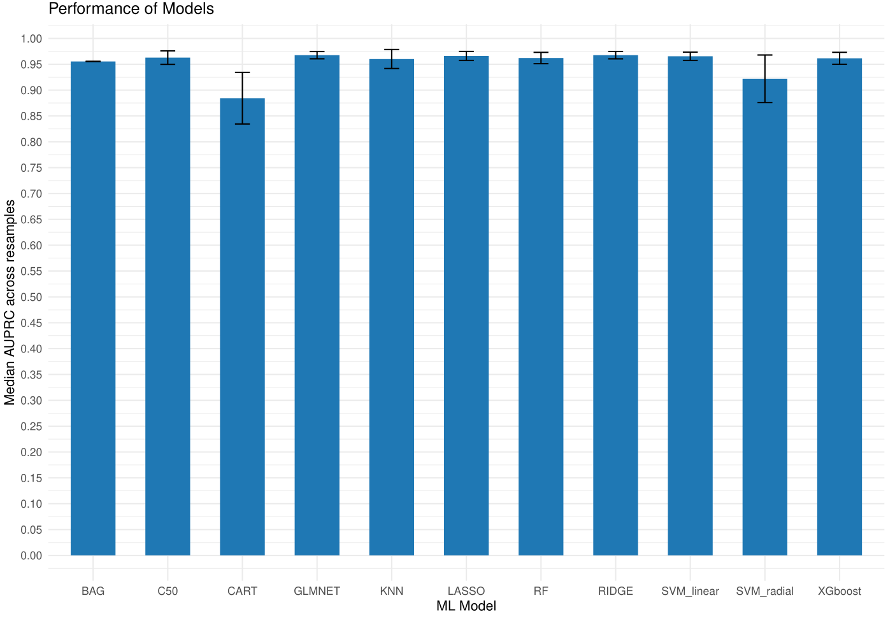
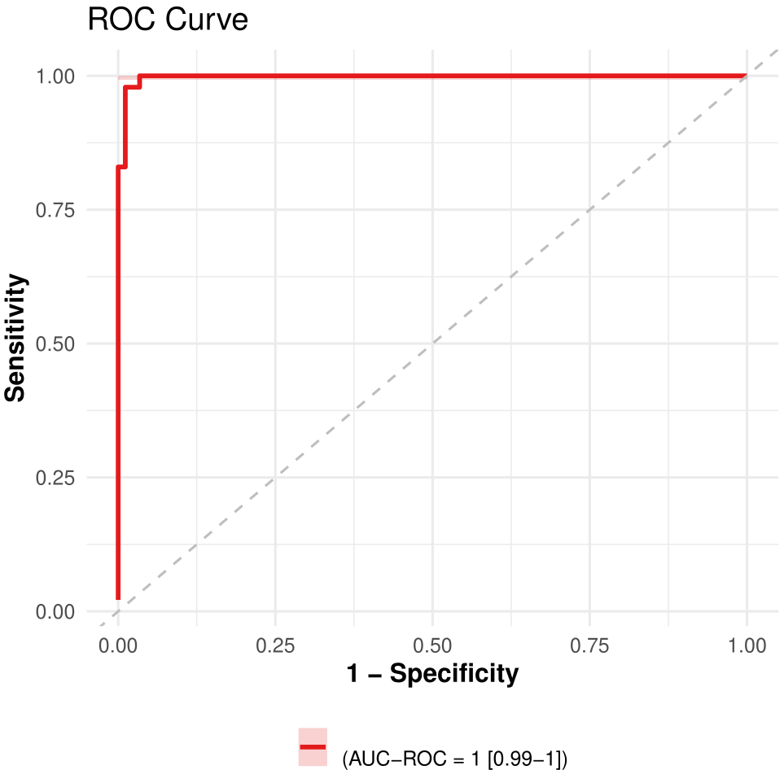
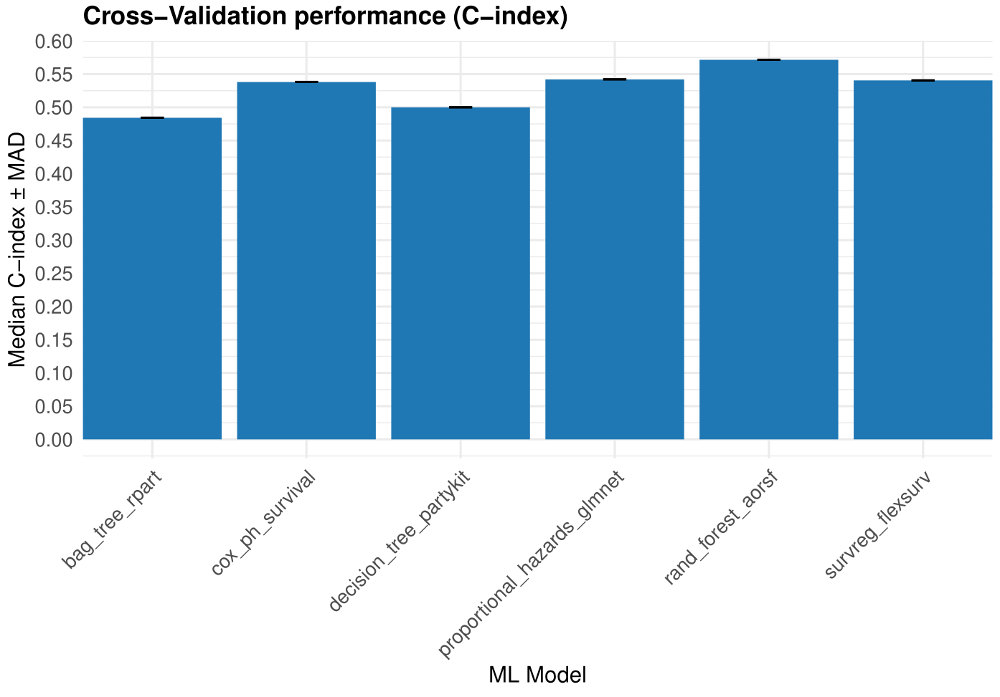
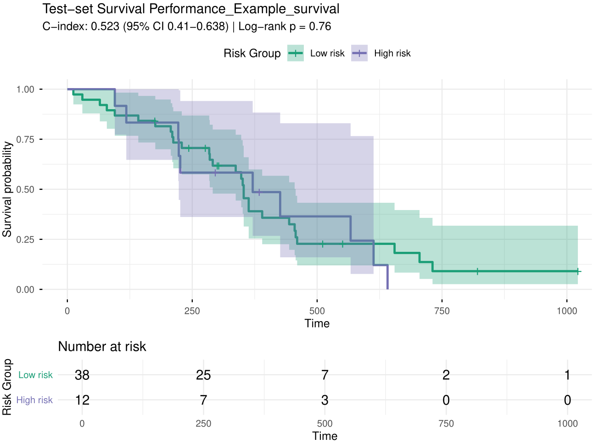
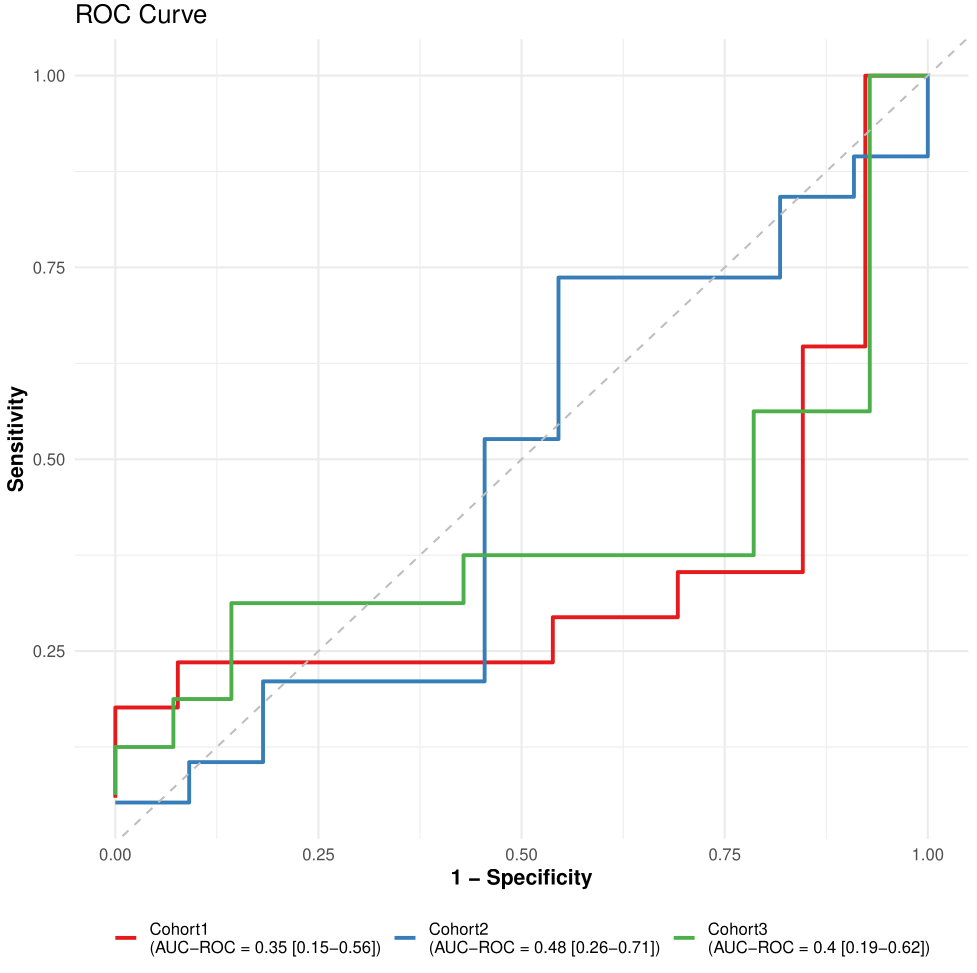
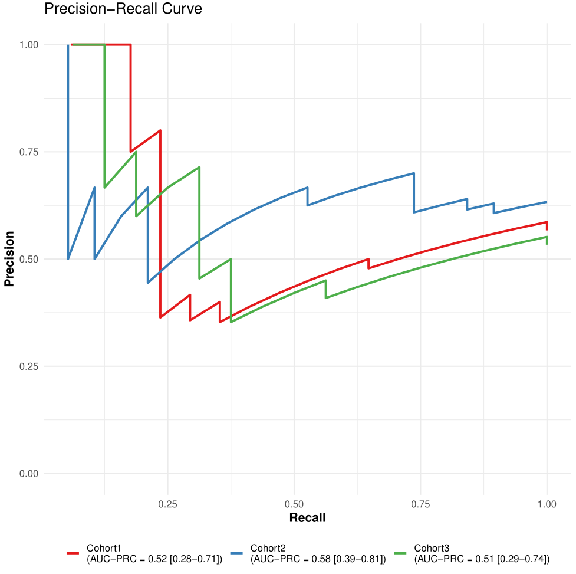

```{r, include = FALSE}
knitr::opts_chunk$set(
  collapse = TRUE,
  comment = "#>"
)
```

```{r setup}
library(pipeML)
library(caret)
library(dplyr)
```

This tutorial demonstrates how to use the `pipeML` package for training and testing machine learning models. It introduces the main functions of the pipeline and guides you through additional functions for visualization. 

# **Classification tasks**

Load example data 
```{r}
data = pipeML::data_example_classification
X <- data %>% dplyr::select(-target)
y <- data$target
```

For example purposes we make a Train/Test split
```{r}
set.seed(123)

train_idx <- caret::createDataPartition(y, p = 0.8, list = FALSE)

X_train <- X[train_idx, ]
X_test  <- X[-train_idx, ]

y_train <- y[train_idx]
y_test  <- y[-train_idx]
```

## **Feature selection**

Apply repeated feature selection using the Boruta algorithm:
```{r}
y = as.factor(y)
res_boruta <- feature.selection.boruta(
  data = data,
  iterations = 20,
  fix = FALSE,
  doParallel = FALSE,
  threshold = 0.8,
  file_name = "Test",
  return = FALSE
)
```

Inspect the results:
```{r}
head(res_boruta$Matrix_Importance)

cat("Confirmed features:\n", res_boruta$Confirmed)

cat("Tentative features:\n", res_boruta$Tentative)
```

To further assess tentative features, set `fix = TRUE` to rerun the selection and confirm or reject them:
```{r, eval = FALSE}
res_boruta <- feature.selection.boruta(
  data = data,
  iterations = 20,
  fix = TRUE,
  doParallel = FALSE,
  threshold = 0.8,
  file_name = "Test",
  return = FALSE
)
```

For faster execution, enable parallelization (ensure parameters `doParallel` and `workers` are set):
```{r, eval = FALSE}
res_boruta <- feature.selection.boruta(
  data = data,
  iterations = 20,
  fix = FALSE,
  doParallel = FALSE,
  workers = 2,
  threshold = 0.8,
  file_name = "Test",
  return = FALSE
)
```

## **Train machine learning models for classification tasks**

Train and tune models using repeated stratified k-fold cross-validation:
```{r}
res <- compute_features.training.ML(features_train = X_train, 
                                     target_var = y_train,
                                     task_type = "classification",
                                     trait.positive = "1",
                                     metric = "AUROC",
                                     k_folds = 2,
                                     n_rep = 1,
                                     file_name = "Example_classification",
                                     ncores = 2,
                                     return = TRUE)
```

Access the best-trained model:
```{r}
res$Model
```

View all trained and tuned machine learning models:
```{r}
names(res$ML_Models)
```

```{r fig1, fig.cap="Figure 1. Models training performance.", fig.align='center', out.width='80%'}

```

## **Model prediction**

After training, users can predict on new data by using the `compute_prediction()` function. You can specify which metric to maximize when determining the optimal classification threshold. Supported values for maximize include: "Accuracy", "Precision", "Recall", "Specificity", "Sensitivity", "F1", and "MCC".
```{r}
pred = compute_prediction(model = res$Model, 
                          test_data = X_test, 
                          target_var = y_test, 
                          task_type = "classification",
                          trait.positive = "1", 
                          file.name = "Example_classification", 
                          return = T)
```

Check predicitions
```{r}
head(pred$Predictions)
```

Verify threshold-based predictions metrics
```{r}
head(pred$Metrics)
```

If `return = TRUE`, `compute_prediction()` will saved the RO and PR curves in the `Results/` directory.

```{r fig2, fig.cap="Figure 2. ROC curve.", fig.align='center', out.width='80%'}

```

```{r fig3, fig.cap="Figure 3. PR curve.", fig.align='center', out.width='80%'}
knitr::include_graphics("figures/PR.png")
```

## **Compute SHAP Values**

SHAP values help interpret machine learning predictions by quantifying feature contributions.
```{r, eval = FALSE}
df = cbind(X_train, target = as.numeric(y_train)) ## compute_shap_values expects predictors and target in a single data.frame

shap_classification <- compute_shap_values(
  model_trained = res$Model, 
  data_train = df, 
  task_type = "classification", 
  target_col = "target", 
  trait.positive = "2", # Notice here that because of as.numeric() our target variable changed to 1 and 2 so we will consider 2 as our new 1.
  n_cores = 2,  
  file.name = "Example_classification"
)
```

Visualize feature importance and interactions using shapviz:
```{r, eval = FALSE}
sv <- shapviz::shapviz(
  shap = as.matrix(shap_classification$shap_values),
  X = df[, setdiff(colnames(df), "target")]
)

# Global feature importance (bar plot)
shapviz::sv_importance(sv, kind = "bar") +
  ggplot2::ggtitle("Global Feature Importance")

# Beeswarm plot
shapviz::sv_importance(sv, kind = "beeswarm") +
  ggplot2::ggtitle("SHAP Beeswarm Summary")

# Feature dependence plots for top 6 features
top_features <- names(sort(colMeans(abs(shap_classification$shap_values)), decreasing = TRUE))[1:6]

for (f in top_features) {
  print(
    shapviz::sv_dependence(sv, v = f) +
    ggplot2::ggtitle(paste0("Dependence: ", f))
  )
}
```

To apply model stacking, set `stack = TRUE`:
```{r, eval = FALSE}
res <- compute_features.training.ML(features_train = deconvolution, 
                                    target_var = traitData$Best.Confirmed.Overall.Response,
                                    task_type = "classification",
                                    trait.positive = "CR",
                                    metric = "AUROC",
                                    stack = TRUE,
                                    k_folds = 2,
                                    n_rep = 2,
                                    LODO = FALSE,
                                    file_name = "Test",
                                    ncores = 2,
                                    return = FALSE)
```

Inspect the base models used in stacking:
```{r, eval = FALSE}
res$Model$Base_models
```

Access the meta-learner:
```{r, eval = FALSE}
res$Model$Meta_learner
```

# **Survival tasks**

In addition to classification and regression tasks, `pipeML` supports survival analysis, allowing users to train machine learning models that predict time-to-event outcomes.

In survival analysis, the response variable is defined by two components:

- Time: follow-up or survival time
- Event: indicator of whether the event occurred (1) or the observation was censored (0)

`pipeML` automates the training, evaluation, and interpretation of survival models using cross-validation and SHAP-based explanations.

Load example dataset for survival
```{r}
library(survival)
library(censored)
data = pipeML::data_example_survival
X <- data %>% dplyr::select(-time, -status)
time <- data$time
event <- data$status
```

Similar to the previous example, we will split our data in Train/Test
```{r}
set.seed(123)
train_idx <- caret::createDataPartition(event, p = 0.7, list = FALSE)

X_train <- X[train_idx, ]
X_test  <- X[-train_idx, ]

time_train <- time[train_idx]
time_test  <- time[-train_idx]

event_train <- event[train_idx]
event_test  <- event[-train_idx]
```

## **Train machine learning models for survival tasks**

The function ` compute_features.training.ML()`  can also train survival models by setting task_type = "survival".
```{r}
res_survival <- compute_features.training.ML(
  features_train = X_train, 
  task_type = "survival",
  time_var = time_train,
  event_var = event_train,
  k_folds = 2,
  n_rep = 1,
  file_name = "Example_survival",
  ncores = 4,
  return = TRUE
)
```

Access to the best model 
```{r}
res_survival$Model$Model_object
```

Check training metrics
```{r}
head(res_survival$Model$Prediction_folds)
```

```{r fig4, fig.cap="Figure 4. Models training performance.", fig.align='center', out.width='80%'}

```

## **Compute SHAP Values**

We will used the same function `compute_shap_values` computed before but this time with the `task_type = "survival"`.
```{r, eval = FALSE}
shap_survival <- compute_shap_values(
  model_trained = res_survival$Model,
  data_train = df,
  task_type = "survival",
  time_col = "time",
  event_col = "status",
  n_cores = 2,
  file.name = "Example_survival"
)
```

## **Predict Survival risk**

After training, predictions can be generated using `compute_prediction()`.
```{r}
pred <- compute_prediction(
  model = res_survival$Model,
  test_data = X_test,
  task_type = "survival",
  time_var = time_test,
  event_var = event_test,
  file.name = "Example_survival",
  return = TRUE
)
```

Unlike classification models, survival models may return different types of predictions depending on the model used. Some models predict a risk score, while others predict expected survival time or survival probability.

The `compute_prediction()` function automatically handles these differences. Internally, it attempts several prediction types and converts them into a standardized risk score so that results can be compared across models:

- Risk score (**linear_pred**) – typically produced by Cox models.
Higher values indicate higher predicted risk.
- Predicted survival time (**time**) – produced by some parametric survival models.
Higher values indicate longer survival, so the values are internally reversed to represent risk.
- Survival probability (**survival**) – probability of surviving at a given time point.
Higher probabilities correspond to lower risk, so these values are also internally reversed.

After this standardization step, predictions are always interpreted in the same way:

**Higher prediction values correspond to higher predicted risk**

This allows `pipeML` to compute performance metrics such as the concordance index (C-index) and to stratify patients into risk groups for Kaplan–Meier visualization.

```{r fig5, fig.cap="Figure 5. KM plot.", fig.align='center', out.width='80%'}

```

## **Train and predict using the machine learning models**

If a separate testing dataset is already available, pipeML allows you to train models and generate predictions in a single step using the compute_features.ML() function. This function performs model training, hyperparameter tuning, and evaluation on the training data, and then applies the selected model to the test dataset.

Classification tasks 
```{r}
res <- compute_features.ML(features_train = X_train, 
                           features_test = X_test, 
                           coldata = data,
                           task_type = "classification",
                           trait = "target",
                           trait.positive = "1",
                           metric = "AUROC",
                           k_folds = 2,
                           n_rep = 1,
                           ncores = 2,
                           file_name = "Test",
                           return = FALSE)
```

Check training metrics
```{r}
head(res$Model$Model$pred)
```

Check prediction metrics
```{r}
head(res$Metrics)
```

Survival tasks 
```{r}
res <- compute_features.ML(features_train = X_train, 
                           features_test = X_test, 
                           coldata = data,
                           task_type = "survival",
                           time_var = "time",
                           event_var = "status",
                           k_folds = 2,
                           n_rep = 1,
                           ncores = 2,
                           file_name = "Test",
                           return = FALSE)
```

## **Leaving one dataset out (LODO) analysis**

If your data includes features from multiple cohorts, `pipeML` provides a flexible approach to perform Leave-One-Dataset-Out (LODO) analysis. This is achieved by applying k-fold stratified sampling across batches, ensuring that each fold preserves the batch structure while maintaining class balance. For this set `LODO = TRUE` and provided column name containing the batch information in the `batch_var` variable

Below, we demonstrate how to perform a LODO analysis using simulated datasets:

Simulate datasets from different batches
```{r}
set.seed(123)

# Simulate traitData with 3 cohorts
traitData <- data.frame(
  Sample = paste0("Sample", 1:90),
  Response = sample(c("R", "NR"), 90, replace = TRUE),
  Cohort = rep(paste0("Cohort", 1:3), each = 30),
  stringsAsFactors = FALSE
)
rownames(traitData) <- traitData$Sample

# Simulate counts matrix 
counts_all <- matrix(rnorm(1000 * 90), nrow = 1000, ncol = 90)
rownames(counts_all) <- paste0("Gene", 1:1000)
colnames(counts_all) <- traitData$Sample

# Simulate some example features 
features_all <- matrix(runif(90 * 15), nrow = 90, ncol = 15)
rownames(features_all) <- traitData$Sample
colnames(features_all) <- paste0("Feature", 1:15)
```

Perform LODO analysis
```{r}
prediction = list()
i = 1
for (cohort in unique(traitData$Cohort)) {
    
  # Test cohort
  traitData_test = traitData %>%
    filter(Cohort == cohort)
  counts_test = counts_all[,colnames(counts_all)%in%rownames(traitData_test)]
  features_test = features_all[rownames(features_all)%in%rownames(traitData_test),]

  # Train cohort
  traitData_train = traitData %>%
    filter(Cohort != cohort)
  counts_train = counts_all[,colnames(counts_all)%in%rownames(traitData_train)]
  features_train = features_all[rownames(features_all)%in%rownames(traitData_train),]

  #### ML Training
  res = compute_features.training.ML(features_train = features_train, 
                                     target_var = traitData_train$Response, 
                                     task_type = "classification",
                                     trait.positive = "R", 
                                     metric = "AUROC", 
                                     k_folds = 2, 
                                     n_rep = 1, 
                                     LODO = TRUE,
                                     batch_var = traitData_train$Cohort, 
                                     ncores = 2, 
                                     return = F)

  #### ML predicting
  
  #### Testing
  pred = compute_prediction(model = res$Model, 
                            test_data = features_test, 
                            target_var = traitData_test$Response, 
                            task_type = "classification",
                            trait.positive = "R", 
                            return = F)
  
  #### Save results
  prediction[[i]] = pred
  names(prediction)[i] = cohort
  i = i + 1
}
```

For plotting we will make use of our `get_curves` function adapted in a case for multiple cohorts. This function is implemented inside `compute_prediction` to make the RO and PR curves.

Extract prediction metrics and join
```{r}
roc_data <- lapply(names(prediction), function(cohort) {
  df <- prediction[[cohort]]$Metrics
  df$cohort <- cohort
  df
}) %>% dplyr::bind_rows()

auc_roc <- list(
  mean  = sapply(prediction, function(x) x$AUC$AUROC$mean),
  lower = sapply(prediction, function(x) x$AUC$AUROC$lower),
  upper = sapply(prediction, function(x) x$AUC$AUROC$upper)
)

auc_prc <- list(
  mean  = sapply(prediction, function(x) x$AUC$AUPRC$mean),
  lower = sapply(prediction, function(x) x$AUC$AUPRC$lower),
  upper = sapply(prediction, function(x) x$AUC$AUPRC$upper)
)
```

Plot RO and PR curves
```{r}
get_curves(
  data = roc_data,
  color = "cohort",
  auc_roc = auc_roc,
  auc_prc = auc_prc,
  LODO = TRUE,
  file.name = "LODO_cohort_example",
  width = 9,
  height = 9
)
```

```{r fig6, fig.cap="Figure 6. LODO RO curves.", fig.align='center', out.width='80%'}

```

```{r fig7, fig.cap="Figure 7. LODO PR curves.", fig.align='center', out.width='80%'}

```

## **Leakage-aware custom cross-validation**

A central design principle of `pipeML` is to prevent information leakage during model training and evaluation. In many machine learning workflows, feature engineering steps are applied to the full dataset before cross-validation, which can inadvertently introduce information from the test folds into the training process. This leads to overoptimistic performance estimates.

To address this, `pipeML` provides built-in support for custom fold construction through the fold_construction_fun argument in `compute_features.training.ML()`. This mechanism allows feature engineering and preprocessing steps to be recomputed independently within each cross-validation fold, ensuring that test samples never influence the training process.

This capability is a core component of the `pipeML` pipeline, enabling leakage-aware model development for datasets where features depend on the full sample structure.

#### Why custom fold construction is important?

In many biological and high-dimensional datasets, features are not independent variables but are derived from the data itself. Examples include:

- correlation-based clustering
- dimensionality reduction (e.g., PCA)
- gene set enrichment or pathway scoring
- transcription factor activity inference
- aggregation of features across samples

If these transformations are applied to the entire dataset before cross-validation, the test samples influence how the feature space is constructed. As a result, the model indirectly “sees” information from the test data during training.

By recomputing these steps within each fold, `pipeML` ensures that: 
- training data are used to define the feature space
- test samples are projected onto the learned space without influencing it
- model evaluation reflects true out-of-sample performance

This approach closely mimics how the model would behave when applied to completely unseen data, producing more realistic performance estimates.

Step 1 – Define a base feature function (example: WGCNA)

**Structure of the Base Feature Function**

The function is designed around two operational modes:
- Training Mode (modules is NULL): The function learns the feature structure from the input dataset.
- Projection Mode (modules provided): The function applies a previously learned structure to new data.

Why the Function Returns Two Objects
- features → always returned; the transformed representation of the current dataset (training or test).
- modules (or structure) → returned only when learning from training data; needed to project test data in future steps.

This ensures a leakage-aware workflow:
- Training data defines the feature space.
- Test data is projected without altering the learned structure.

Structure of base function
```{r, eval= FALSE}
# Generic modular feature computation function
# Can be adapted for clustering, PCA, TF activity, or any sample-dependent feature extraction
compute_features_modular <- function(data, structure = NULL, ...) {
  
  # data: features as rows, samples as columns
  # structure: precomputed structure (e.g., clusters, components); NULL for training
  # ... : additional arguments specific to the algorithm used
  
  # TRAINING MODE: learn the structure from the training data
  if (is.null(structure)) {
    
    # --- Replace this block with any feature-learning algorithm ---
    # Example placeholder: clustering / PCA / network modules
    structure <- learn_structure(data, ...)   # user-defined function
    
  }
  
  # PROJECT MODE: compute features for new data using the learned structure
  # --- Replace this block with algorithm-specific projection logic ---
  features <- project_data(data, structure, ...)   # user-defined function
  
  # Return both features and structure
  # structure will be reused for test/projection data in cross-validation
  return(list(
    features = features,
    structure = structure
  ))
}
```

Here we illustrate a correlation-based feature computation using Weighted Gene Co-expression Network Analysis (WGCNA). This is just an example: in practice, you can use any feature computation that depends on multiple samples, such as clustering, PCA, among others.
```{r, eval= FALSE}
# WGCNA feature computation function
compute_wgcna_features <- function(counts, power = 6, modules = NULL) {
  
  # counts: features as rows, samples as columns
  # power: soft-thresholding power for WGCNA
  # modules: precomputed modules; NULL for training mode
  
  ## Just preprocessing 
  rownames(counts) <- gsub("-", ".", rownames(counts)) # Standardize gene names
  datExpr <- t(counts) # Transpose so samples are rows
  
  # TRAINING MODE: learn modules from training data
  if (is.null(modules)) {
    
    net <- WGCNA::blockwiseModules(
      datExpr,
      power = power,
      TOMType = "unsigned",
      minModuleSize = 30,
      verbose = 0
    )
    
    modules <- net$colors
    names(modules) <- colnames(datExpr)
  }
  
  # PROJECT MODE (or after training): compute module eigengenes
  module_features <- sapply(unique(modules), function(mod) {
    genes <- names(modules[modules == mod])
    pc <- prcomp(datExpr[, genes, drop = FALSE])
    pc$x[, 1]   # first principal component = module eigengene
  })
  
  ## Just formatting
  colnames(module_features) <- paste0("Module_", seq_len(ncol(module_features)))
  
  # Return both features and modules (structure)
  return(list(
    features = as.matrix(module_features),
    structure = modules
  ))
}
```

Step 2 – Make the function suitable for `pipeML`

We then need to extend and give the correct format to this function to make it suitable for running across folds inside `pipeML`

This template provides a modular framework to prepare cross-validation folds for `pipeML` in a leakage-aware way. It separates training vs projection:

- Training mode: computes features and learns the data structure from the training folds
- Projection mode: applies the learned structure to held-out folds without influencing it.

Users can easily adapt this template by replacing their previous `compute_features_modular` function

**Note**

In `pipeML` data corresponds to samples as rows and features as columns. If your `compute_features_modular()` needs features as rows, make sure to `t()` inside this function.

The parameters `data`, `folds`, `besttune` are taking care inside pipeML automatically once `fold_construction_fun` is set. Be sure to not change the parameteres names or delete them! 

```{r, eval= FALSE}
# Generic template to prepare leakage-aware folds for pipeML
# Users can replace `compute_features_function` with any algorithm (e.g., PCA, clustering)
prepare_custom_folds <- function(data, folds = NULL, bestune = NULL, ...) {
  
  #' @param ... Additional parameters passed to your feature function

  # Full dataset mode (optional, e.g., for training on all data)
  if (!is.null(bestune)) {
    
    obs_train <- data$target
    data$target <- NULL
    
    ## Here make sure compute_features_modular() returns a matrix with the features. If not, make sure to extract them before adding     the target column
    train_features_final <- compute_features_modular(data, ...)  # or t(data) if necessary
    ## train_features_final = train_features_final$features --> if necessary
    train_features_final$target <- obs_train
    
    custom_output <- result
    
    return(list(train_features_final, custom_output, bestune))
    
  } else {
    
    # Cross-validation mode
    processed_folds <- list()
    
    for (i in seq_along(folds)) {
      
      train_idx <- folds[[i]]
      test_idx  <- setdiff(seq_len(nrow(data)), train_idx)
      
      # ---- TRAIN DATA ----
      train_data <- data[train_idx, , drop = FALSE]
      obs_train <- train_data$target
      train_data$target <- NULL
      
      train_features <- compute_features_modular(train_data, ...) # or t(train_data) if necessary
      ## train_features = train_features$features --> if necessary
      train_features$target <- obs_train
      
      # ---- TEST DATA (projection) ----
      test_data <- data[test_idx, , drop = FALSE]
      obs_test <- test_data$target
      test_data$target <- NULL
      
      test_features <- compute_features_modular(
        test_data, # or t(test_data) if necessary
        structure = train_result$structure,  # Use training structure
        ...
      )
      ## test_features = test_features$features --> if necessary

      
      # ---- Save fold information ----
      processed_folds[[i]] <- list(
        train_data = train_features,
        test_data  = test_features,
        obs_test   = obs_test,
        rowIndex   = test_idx,
        fold_name  = names(folds)[i]
      )
    }
    
    # Save temporal fold objects to disk (this will be removed at the end of the ML training)
    for (i in seq_along(processed_folds)) {
      filename <- file.path("Results", paste0("fold_", names(folds)[i], ".rds"))
      saveRDS(processed_folds[[i]], file = filename)
    }
    
    return(processed_folds)
  }
}
```

Here we illustrate how the function will look applying our `compute_wgcna_features()` function
```{r, eval= FALSE}
prepare_WGCNA_folds <- function(data, folds = NULL, bestune = NULL, power) {
  
  if (!is.null(bestune)) {
    
    obs_train <- data$target
    data$target <- NULL
    
    wgcna_result <- compute_wgcna_features(t(data), power = power)
    
    train_cell_data_final <- as.data.frame(wgcna_result$features)
    train_cell_data_final$target <- obs_train
    
    custom_output <- wgcna_result
    
    return(list(train_cell_data_final, custom_output, bestune))
    
  } else {
    
    processed_folds <- list()
    
    for (i in seq_along(folds)) {
      
      train_idx <- folds[[i]]
      test_idx  <- setdiff(seq_len(nrow(data)), train_idx)
      
      # ---- TRAIN DATA ----
      train_data <- data[train_idx, , drop = FALSE]
      obs_train <- train_data$target
      train_data$target <- NULL
      
      wgcna_train <- compute_wgcna_features(t(train_data), power = power)
      
      train_features <- as.data.frame(wgcna_train$features)
      train_features$target <- obs_train
      
      # ---- TEST DATA (projection) ----
      test_data <- data[test_idx, , drop = FALSE]
      obs_test <- test_data$target
      test_data$target <- NULL
      
      wgcna_test <- compute_wgcna_features(t(test_data), modules = wgcna_train$modules)
      test_features <- as.data.frame(wgcna_test$features)
      
      # ---- SAVE FOLD ----
      processed_folds[[i]] <- list(
        train_data = train_features,
        test_data  = test_features,
        obs_test   = obs_test,
        rowIndex   = test_idx,
        fold_name  = names(folds)[i]
      )
    }
    
    # ---- Save folds ----
    for (i in seq_along(processed_folds)) {
      filename <- file.path("Results", paste0("fold_", names(folds)[i], ".rds"))
      saveRDS(processed_folds[[i]], file = filename)
    }
    
    return(processed_folds)
  }
}
```

Load data example (Gene expression counts)
```{r}
counts = pipeML::counts_example
coldata = pipeML::coldata_example
```

Step 3 – Run Custom Cross-Validation

Once your custom fold function is ready, pass it to `compute_features.training.ML()` via fold_construction_fun.

Note the argument  `fold_construction_args_fixed` corresponds to the additional parameters passed in `prepare_custom_folds()` function (in this example `prepare_WGCNA_folds()`). They should be set with the value to use when running your function. If your function does not have any parameters, you can ignore this argument and it will set up to NULL.

```{r, eval=FALSE}
## counts: Normalized counts to compute the features from the training samples
## coldata: Target variable from the training samples
res_custom   = compute_features.training.ML(features_train = t(counts),
                                            target_var     = coldata$Response,
                                            task_type      = "classification",
                                            trait.positive = "R",
                                            metric         = "AUROC",
                                            k_folds        = 2,
                                            n_rep          = 1,
                                            return         = FALSE,
                                            fold_construction_fun = prepare_WGCNA_folds,
                                            fold_construction_args_fixed = list(power=6))
```

Notice that `res_custom$Custom_output` contains the output features of your base function in case these are needed (e.g. for prediction see below)
```{r, eval= FALSE}
res_custom$Custom_output
```

#### Tunable hyperparameters within custom fold functions

In some scenarios, the feature construction step may include parameters whose values can influence model performance. For example, when computing WGCNA, parameters such as soft-thresholding power, minimum module size, module merging threshold, and module splitting sensitivity may affect the resulting features and therefore the downstream model performance.

To address this, `pipeML` supports hyperparameter tuning within your custom fold functions. This allows users to identify which parameter values lead to the best predictive performance.

Briefly, the user provides a grid of candidate parameter values, and `pipeML` will:

- construct custom cross-validation folds for each parameter combination
- train and evaluate machine learning models for each configuration
- compare the resulting performance across folds and repetitions
- return the parameter values that maximize the selected performance metric

Before that, user needs to modify `prepare_custom_folds()` to account for all these parameters. In this case
```{r, eval= FALSE}
# Generic template to prepare leakage-aware folds for pipeML with hyperparameter tuning
# Users can replace `compute_features_function` with any algorithm (e.g., PCA, clustering)
prepare_custom_folds_with_tuning <- function(
  data,
  folds = NULL,
  bestune = NULL,
  ncores = NULL,
  ...
) {
  
  #' @param ... Additional parameters passed to your feature function
  
  # ---- Full dataset mode with best parameters ----
  if (!is.null(bestune)) {
    
    obs_train <- data$target
    data$target <- NULL
    
    ## Ensure compute_features_function() returns a list with features and structure
    result <- compute_features_function(
      counts = t(data),  # transpose if necessary
      !!!bestune,        # pass best parameters as arguments
      ...
    )
    
    train_features_final <- as.data.frame(result$features)
    train_features_final$target <- obs_train
    
    custom_output <- result
    
    return(list(train_features_final, custom_output, bestune))
    
  } else {
    
    # ---- Cross-validation mode ----
    processed_folds <- list()
    
    # ---- Create parameter grid for tuning ----
    if (length(hyperparams) > 0) {
      param_grid <- expand.grid(hyperparams, stringsAsFactors = FALSE)
    } else {
      param_grid <- NULL
    }
    
    # ---- Parallel setup ----
    if (!is.null(param_grid) & is.null(ncores)) {
      ncores <- parallel::detectCores() - 2
    }
    if (!is.null(ncores) & !is.null(param_grid)) {
      cl <- parallel::makeCluster(ncores)
      doParallel::registerDoParallel(cl)
    }
    
    for (i in seq_along(folds)) {
      
      train_idx <- folds[[i]]
      test_idx  <- setdiff(seq_len(nrow(data)), train_idx)
      
      # ---- TRAIN DATA ----
      train_data <- data[train_idx, , drop = FALSE]
      obs_train <- train_data$target
      train_data$target <- NULL
      
      if (!is.null(param_grid)) {
        # ---- Loop over hyperparameter combinations ----
        fold_results <- lapply(seq_len(nrow(param_grid)), function(j) {
          params <- param_grid[j, ]
          
          train_result <- compute_features_function(
            counts = t(train_data),  # transpose if necessary
            !!!params,
            ...
          )
          train_features <- as.data.frame(train_result$features)
          train_features$target <- obs_train
          
          # ---- TEST DATA (projection) ----
          test_data <- data[test_idx, , drop = FALSE]
          obs_test <- test_data$target
          test_data$target <- NULL
          
          test_result <- compute_features_function(
            counts = t(test_data),
            structure = train_result$structure,
            ...
          )
          test_features <- as.data.frame(test_result$features)
          
          list(
            train_data = train_features,
            test_data  = test_features,
            obs_test   = obs_test,
            rowIndex   = test_idx,
            fold_name  = names(folds)[i],
            params     = params
          )
        })
        
        processed_folds[[i]] <- fold_results
        
      } else {
        # ---- Single parameter set ----
        train_result <- compute_features_function(
          counts = t(train_data),
          ...
        )
        train_features <- as.data.frame(train_result$features)
        train_features$target <- obs_train
        
        test_data <- data[test_idx, , drop = FALSE]
        obs_test <- test_data$target
        test_data$target <- NULL
        
        test_result <- compute_features_function(
          counts = t(test_data),
          structure = train_result$structure,
          ...
        )
        test_features <- as.data.frame(test_result$features)
        
        processed_folds[[i]] <- list(
          train_data = train_features,
          test_data  = test_features,
          obs_test   = obs_test,
          rowIndex   = test_idx,
          fold_name  = names(folds)[i]
        )
      }
      
      # ---- Save fold objects to disk ----
      filename <- file.path("Results", paste0("fold_", names(folds)[i], ".rds"))
      saveRDS(processed_folds[[i]], file = filename)
      
    }
    
    # ---- Stop parallel backend if used ----
    if (!is.null(ncores) & !is.null(param_grid)) {
      parallel::stopCluster(cl)
      unregister_dopar()
    }
    
    return(processed_folds)
  }
}
```

In our case it would be
```{r, eval= FALSE}
prepare_WGCNA_folds_modular <- function(
    data,
    folds = NULL,
    bestune = NULL,
    ncores = NULL,
    power,
    TOMType,
    minModuleSize,
    mergeCutHeight,
    deepSplit
) {
  
  if (!is.null(bestune)) {
    # ---- Full training set with best parameters ----
    obs_train <- data$target
    data$target <- NULL
    
    required_cols <- c("power", "minModuleSize", "mergeCutHeight", "deepSplit")
    
    best_params <- if (is.data.frame(bestune)) {
      if (all(required_cols %in% names(bestune))) {
        dplyr::select(bestune, dplyr::all_of(required_cols))
      } else {
        message("bestune missing some parameters; using defaults.")
        tibble::tibble(
          power = power,
          TOMType = TOMType,
          minModuleSize = minModuleSize,
          mergeCutHeight = mergeCutHeight,
          deepSplit = deepSplit
        )
      }
    } else if (is.list(bestune)) {
      if (all(required_cols %in% names(bestune))) {
        tibble::as_tibble(bestune[required_cols])
      } else {
        message("bestune missing some parameters; using defaults.")
        tibble::tibble(
          power = power,
          TOMType = TOMType,
          minModuleSize = minModuleSize,
          mergeCutHeight = mergeCutHeight,
          deepSplit = deepSplit
        )
      }
    } else {
      stop("`bestune` must be a data.frame or list.")
    }
    
    wgcna_result <- compute_wgcna_features_modular(
      counts = t(data),
      power = best_params$power,
      TOMType = TOMType, ### fix parameter
      minModuleSize = best_params$minModuleSize,
      mergeCutHeight = best_params$mergeCutHeight,
      deepSplit = best_params$deepSplit
    )
    
    train_cell_data_final <- as.data.frame(wgcna_result$features)
    train_cell_data_final$target <- obs_train
    
    custom_output <- wgcna_result
    
    return(list(train_cell_data_final, custom_output, best_params))
    
  } else {
    # ---- Tunable grid ----
    custom_grid <- expand.grid(
      power = power,
      minModuleSize = minModuleSize,
      mergeCutHeight = mergeCutHeight,
      deepSplit = deepSplit,
      stringsAsFactors = FALSE
    )
    
    # ---- Parallel setup ----
    if (is.null(ncores)) ncores <- parallel::detectCores() - 2
    cl <- parallel::makeCluster(ncores)
    doParallel::registerDoParallel(cl)
    
    processed_folds <- foreach::foreach(i = seq_along(folds), .packages = c("dplyr")) %dopar% {
      source("~/Documents/pipeML_paper/scripts/src/utils.R")
      source("~/Documents/pipeML/R/machine_learning.R")
      
      cat("Starting fold", names(folds)[i], "\n")
      
      train_idx <- folds[[i]]
      test_idx <- setdiff(seq_len(nrow(data)), train_idx)
      
      train_data <- data[train_idx, , drop = FALSE]
      obs_train <- train_data$target
      train_data$target <- NULL
      
      test_data <- data[test_idx, , drop = FALSE]
      obs_test <- test_data$target
      test_data$target <- NULL
      
      fold_results <- lapply(seq_len(nrow(custom_grid)), function(j) {
        cat("Starting param combination", j, "\n")
        
        params <- custom_grid[j, ]
        
        # ---- Train WGCNA ----
        wgcna_train <- compute_wgcna_features_modular(
          counts = t(train_data),
          power = params$power,
          TOMType = TOMType,
          minModuleSize = params$minModuleSize,
          mergeCutHeight = params$mergeCutHeight,
          deepSplit = params$deepSplit
        )
        
        train_features <- as.data.frame(wgcna_train$features)
        train_features$target <- obs_train
        
        # ---- Test projection ----
        wgcna_test <- compute_wgcna_features_modular(
          counts = t(test_data),
          modules = wgcna_train$modules
        )
        test_features <- as.data.frame(wgcna_test$features)
        
        list(
          train_data = train_features,
          test_data = test_features,
          obs_test = obs_test,
          rowIndex = test_idx,
          fold_name = names(folds)[i],
          params = params
        )
      })
      
      # Save each fold
      filename <- file.path("Results", paste0("fold_", names(folds)[i], ".rds"))
      saveRDS(fold_results, file = filename)
      
      fold_results
    }
    
    parallel::stopCluster(cl)
    unregister_dopar() # stop background dopar
    
  }
}
```

To enable this functionality, the user must specify the argument `fold_construction_args_tunable`, which contains the set of parameter values to be evaluated 

```{r, eval= FALSE}
res_params <- compute_features.training.ML(features_train = t(counts), 
                                          target_var     = coldata$Response,
                                          task_type = "classification",
                                          trait.positive = "R",
                                          metric = "AUROC",
                                          k_folds = 2,
                                          n_rep = 1,
                                          return = FALSE,
                                          fold_construction_fun = prepare_WGCNA_folds_modular,
                                          fold_construction_args_fixed = list(power=6, ncores = 2),
                                          fold_construction_args_tunable = list(
                                            power = c(6, 8, 10),                 
                                            minModuleSize = c(20, 50, 100),       
                                            mergeCutHeight = c(0.15, 0.25, 0.35),
                                            deepSplit = c(1, 2, 3)           
                                          ))

```

Step 4 – After training Predict on Test Data

To apply the model to new data, compute the same type of features using the learned modules from the training set.
```{r}
test_features = compute_wgcna_features(counts_test, modules = res_custom$Custom_output$modules)$features
```

Prediction
```{r, eval = FALSE}
pred <- compute_prediction(res_custom$Model,
                           test_features,
                           traitData_test[,"Response"],
                           trait.positive = "R",
                           return = FALSE)
```

Why do we need `bestune` argument even if I don't have hyperparams in my function?

For this to work, your custom function must accept a `bestune` argument, which is used internally to inject the optimized parameter values found during the tuning step.

When `bestune` is NULL, the function assumes that tuning has not yet been performed. A grid of candidate parameter values (defined in `fold_construction_args_tunable`) is generated. For each fold, the function iterates through all combinations of parameter values and recomputes the features. This exploration step is parallelized across folds using foreach and doParallel, allowing multiple folds to be processed simultaneously. Parallelization reduces runtime considerably when the parameter grid or number of folds is large.

When `bestune` is not NULL, it means the tuning process has already been completed. The optimized parameter values are extracted from the bestune object. Features are then recomputed once on the full training dataset using these tuned parameters. This ensures the final model is trained with the best parameter setting identified during cross-validation.

In summary, the `bestune` argument acts as a control switch:

- NULL → run parameter search with parallelized fold-level evaluation.
- non-NULL → lock in the tuned parameter values and rebuild the features for final training.

This design allows a single custom fold-construction function to handle both hyperparameter tuning (exploration, parallelized) and final model preparation (exploitation, single optimized run).

**NOTE:** `pipeML` is built on top of existing frameworks and makes extensive use of the R packages `caret`, `parnsip`, `tidymodels`, `parsnip` and `censored`. If you use `pipeML` in your work, please cite our package along with these foundational packages. 

# References


